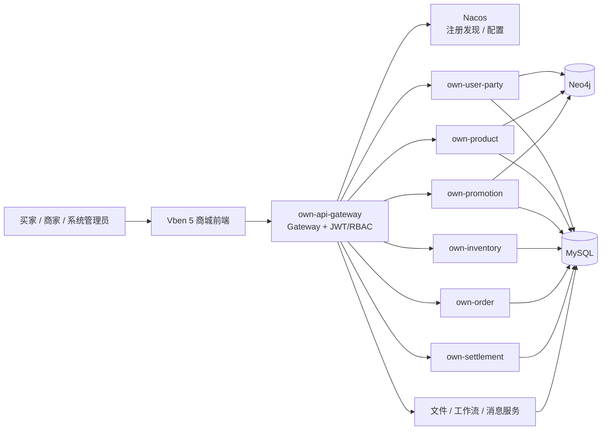

# micro-server-own

[](https://openjdk.org/projects/jdk/17/)
[](https://spring.io/projects/spring-boot)
[](https://sca.aliyun.com/)
[](https://vuejs.org/)
[](https://www.vben.pro/)
[](https://github.com/Blucezhang/micro-server-own/stargazers)
[](https://github.com/Blucezhang/micro-server-own/network/members)
[](#许可证)

简体中文 · [English](README_EN.md)

> 一个面向学习、演示与演进实践的多商家商城微服务项目。项目以 Java 17、Spring Cloud Alibaba、Nacos 和 Vben Admin 5 为当前基线，覆盖从账户、商品与营销，到库存、订单、支付、售后和商家结算的核心交易链路。

## 项目定位

`micro-server-own` 将商城交易中常见的领域拆分为可独立运行、可组合验证的服务：买家下单与售后、商家商品运营和履约、平台账号与内容治理，以及相应的库存、券、支付和结算协同。

项目保留了清晰的工程边界：本地事务、幂等、Outbox、Inbox 与 Saga 补偿是当前一致性实现方向；真实支付、物流、消息消费者和生产部署仍需要在目标环境完成集成验收。

## 技术基线

| 分类 | 当前选择 |
| --- | --- |
| 后端语言与构建 | Java 17、Maven Wrapper 3.9.16 |
| 应用框架 | Spring Boot 4.0.0、Spring Cloud 2025.1.0 |
| 服务治理 | Spring Cloud Alibaba 2025.1.0.0、Nacos 3 |
| 网关与安全 | Spring Cloud Gateway、JWT、RBAC、内部服务令牌 |
| 数据存储 | MySQL 5.7（交易数据）、Neo4j（既有用户/商品/促销图数据） |
| 前端 | Vue 3、TypeScript、Vite、Vben Admin 5 |
| 异步能力 | Outbox、Inbox；可选 RocketMQ 订单事件发布 |

## 核心能力

- **多角色门户**：买家、商家、系统管理员基于 `ROLE_BUYER`、`ROLE_MERCHANT`、`ROLE_SYSTEM` 隔离路由与工作台。
- **完整交易主链路**：地址簿、购物车、价格校验、按商家拆单、运费、库存预占、支付确认、发货、签收、售后和结算。
- **商品与营销运营**：商品发布/编辑、上下架、收藏、评价举报、价格审计、平台券、店铺券、领券、占券和核销。
- **交易可靠性**：写请求使用 `Idempotency-Key`；库存、优惠券、支付与退款在本地边界内处理幂等、确认、释放与回补。
- **可验收前端**：内置 Vben 5 商城控制台，开发模式提供纯浏览器内的三类角色 UI 演示入口，不依赖真实账户或后端写入。

## 架构概览



## 服务地图

| 服务 | 主要职责 | 默认端口 |
| --- | --- | ---: |
| `own-api-gateway` | 统一入口、JWT/RBAC、路由与关联 ID | 9632 |
| `own-user-party` | 注册、登录、Refresh Session、角色、地址簿 | 6006 |
| `own-product` | 商品、分类、收藏、评价、举报与价格审计 | 6007 |
| `own-promotion` | 促销规则、券模板、领券、占券与核销 | 6005 |
| `own-inventory` | 库存、预占、确认、回补、调整与阈值 | 6009 |
| `own-order` | 购物车、试算、拆单、履约、售后与 Outbox | 6010 |
| `own-settlement` | 模拟支付、退款、商家应收与模拟结算 | 6011 |
| `own-file` | 临时/正式文件存储与归属校验 | 6004 |
| `own-workflow` | 业务流程与状态记录 | 6008 |
| `own-send-server` | 短信、邮件、推送适配 | 6003 |

## 前端工作台

前端工程位于 [`micro-server-own-web-vben`](micro-server-own-web-vben)，以 Vue 3、TypeScript、Vite 和 Vben Admin 5 实现。

| 门户 | 页面范围 |
| --- | --- |
| 买家 | 商品浏览、购物车、地址簿、结算、订单/支付、售后 |
| 商家 | 商品发布/编辑、价格审计、库存、履约发货、优惠券、运费、结算提现 |
| 系统 | 账号/商家角色授权、角色功能授权、评价举报治理 |

开发模式下，登录页的“买家演示 / 商家演示 / 系统演示”只在浏览器中创建临时身份，方便 UI 验收；不会调用网关或写入真实业务数据，生产构建中不显示这些入口。

## 分支说明

| 分支 | 用途 |
| --- | --- |
| `master` | 当前维护主线：Java 17、Spring Boot 4、Spring Cloud Alibaba 与 Nacos 配置基线。 |
| `jdk17` | 与 `master` 同步的 Java 17 升级分支，便于独立验证和回溯。 |

## 快速开始

### 1. 准备环境

- JDK 17
- Docker Compose v2（运行整套环境时需要）
- 可访问的 MySQL、Neo4j、Nacos 实例，或使用 Compose 编排
- Node.js 22.18+ 或 24.12+（运行 Vben 前端时需要）

### 2. 构建后端

```bash
JAVA_HOME=<jdk17> ./mvnw -B -ntp clean verify
git diff --check
```

根 `pom.xml` 是版本治理入口；新增依赖或插件应先在根 POM 管理版本，再由子模块引用。

### 3. 启动基础设施并导入配置

```bash
cp .env.example .env
docker compose --env-file .env up -d mysql neo4j nacos
set -a && . ./.env && set +a
export NACOS_SERVER=http://localhost:8848
bash scripts/import-nacos-config.sh
```

本机 Compose 的 Nacos 默认关闭认证，只适用于开发演示。Nacos 配置在 [`deploy/nacos/config`](deploy/nacos/config)，默认使用 `MICRO_SERVER` Group 与 `public` Namespace。

### 4. 迁移数据库

新库可由 Compose 初始化；已有 MySQL 数据库必须先备份，再执行前向迁移：

```bash
MYSQL_HOST=<host> MYSQL_PORT=3306 MYSQL_USER=<user> \
MYSQL_PASSWORD='<password>' MYSQL_DATABASE=micro \
  bash scripts/apply-migrations.sh
```

Neo4j 图数据升级请遵循 [Neo4j 数据访问现代化运行手册](docs/architecture/neo4j-modernization-runbook.md)：在隔离副本完成恢复、计数比对和业务回归后再切换服务配置。

### 5. 启动后端服务

导入 Nacos 配置后，建议按下面的依赖顺序启动：

1. `own-user-party`、`own-product`、`own-promotion`
2. `own-file`、`own-send-server`、`own-workflow`
3. `own-inventory`、`own-order`、`own-settlement`
4. `own-api-gateway`

单服务启动示例：

```bash
JAVA_HOME=<jdk17> ./mvnw -pl own-order -am spring-boot:run
```

网关入口默认为 `http://localhost:9632`，负责 `/user/**`、`/product/**`、`/sale/**`、`/inventory/**`、`/order/**`、`/settlement/**` 的路由。

### 6. 启动前端

Vite 默认将 `/api` 代理到网关 `http://localhost:9632`：

```bash
cd micro-server-own-web-vben/apps/web-antd
npm run dev
```

访问 `http://127.0.0.1:5176/auth/login`。前端静态质量检查：

```bash
cd micro-server-own-web-vben
npx -y pnpm@11.16.0 --filter @vben/web-antd run typecheck
npx -y pnpm@11.16.0 --filter @vben/web-antd run build
```

## 交易一致性状态

交易服务采用“本地事务 + 幂等 + Outbox + Inbox + Saga 补偿”的最终一致性方向；Neo4j、支付渠道、文件和物流操作不被伪装为全局数据库事务。

| 能力 | 当前状态 | 说明 |
| --- | --- | --- |
| 本地事务与幂等 | 已实现 | 写请求使用 `Idempotency-Key`；库存、券、支付和退款有本地幂等保护。 |
| 库存/优惠券补偿 | 已实现于同步链路 | 下单、取消、超时、支付、退款和售后具备预占、确认、释放或回补逻辑。 |
| Outbox | 已实现 | 订单状态与事件同事务写入 `ord_event`；失败按退避重试。 |
| RocketMQ 发布 | 已实现，默认关闭 | `TRADE_OUTBOX_ROCKETMQ_ENABLED=true` 时向 `trade.order.events` 发布订单事件。 |
| Inbox 去重 | 基础设施已实现 | 库存、促销、结算服务按消费者和事件 ID 去重。 |
| 异步下单与补偿 | 已实现（服务级） | `PROCESSING` 状态按库存预占、优惠券预占推进；失败进入补偿，购物车保留。 |
| 端到端消息 Saga | 未完成 | 库存/促销业务消费者、结果事件、死信和对账尚未接入。 |

`TRADE_SAGA_ASYNC_ENABLED=true`（默认）启用持久化工作器；可用 `TRADE_SAGA_DELAY_MILLIS` 与 `TRADE_SAGA_RETRY_SECONDS` 调整扫描和补偿重试。当前 RocketMQ 与 Inbox 是后续消息驱动 Saga 的基础，不应表述为完成了端到端分布式事务。

## 关键配置

| 配置 | 用途 |
| --- | --- |
| `NACOS_SERVER_ADDR`、`NACOS_USERNAME`、`NACOS_PASSWORD` | Nacos 注册与配置中心 |
| `MYSQL_URL`、`MYSQL_USER`、`MYSQL_PASSWORD` | MySQL 连接 |
| `NEO4J_URI`、`NEO4J_USER`、`NEO4J_PASSWORD` | Neo4j Bolt 连接 |
| `JWT_SECRET`、`JWT_PREVIOUS_SECRET` | JWT 签名与轮换 |
| `INTERNAL_SERVICE_TOKEN` | 服务间内部接口令牌 |
| `PAYMENT_CHANNEL` | 支付模式；默认模拟渠道 |
| `WECHAT_*`、`ALIPAY_*` | 微信、支付宝渠道配置 |
| `ORDER_OUTBOX_WEBHOOK_URL`、`ORDER_OUTBOX_WEBHOOK_SECRET` | 可选订单事件投递目标 |
| `TRADE_OUTBOX_ROCKETMQ_ENABLED`、`ROCKETMQ_NAMESRV_ADDR` | RocketMQ 订单事件发布开关与 NameServer |

完整模板见 [`.env.example`](.env.example)。密钥只能通过环境变量、Secret 管理或受控部署系统提供，不能提交到仓库。

## 部署提示

`docker-compose.yml` 使用 Nacos 3.1.1，业务镜像基于 Java 17；旧 Eureka Server 和 Config Server 已移除。生产部署应：

1. 使用受控的 MySQL、Neo4j、Nacos，并进行备份恢复演练。
2. 先执行 MySQL 前向迁移，再按照 Neo4j 手册验证图数据副本。
3. 将 Nacos 配置导入目标 Namespace/Group，并以 Secret 注入数据库、JWT、内部令牌与支付渠道密钥。
4. 先启动领域服务并确认注册至 Nacos，再启动 Gateway；仅公开 Gateway。
5. 在发布后验证登录、下单、库存、支付回调、退款、Outbox 积压与备份恢复。

## 验证边界

Maven 测试用于验证代码、单元契约和构建。Nacos、RocketMQ、MySQL、Neo4j、支付渠道、物流、消息投递和容器编排仍需在实际目标环境进行集成验收。实施进度与待验证项见 [框架升级与业务迁移计划](docs/architecture/framework-upgrade-plan.md)。

> 当前 `.github/workflows/main.yml` 仍固定使用 JDK 8，尚不代表本项目的 Java 17 基线；因此 README 不展示可能误导的 CI 状态徽章。

## 文档

- [框架升级与业务迁移计划](docs/architecture/framework-upgrade-plan.md)
- [框架升级兼容性基线](docs/architecture/framework-upgrade-inventory.md)
- [Neo4j 数据访问现代化运行手册](docs/architecture/neo4j-modernization-runbook.md)
- [Nacos 配置交付](deploy/nacos/README.md)
- [商城能力路线图](docs/product/mall-capability-roadmap.md)
- [前端项目交接说明](docs/frontend/frontend-project-brief.md)
- [生产部署与渠道接入计划](docs/production-deployment-plan.md)

## 许可证

仓库当前未提供可识别、可执行的开源许可证文本；[`LICENSE.htm`](LICENSE.htm) 也不构成明确的授权声明。因此本 README 不作额外的开源、商用或再分发许可承诺。在使用、分发或商用前，请由仓库维护者补充并确认适用许可证。
