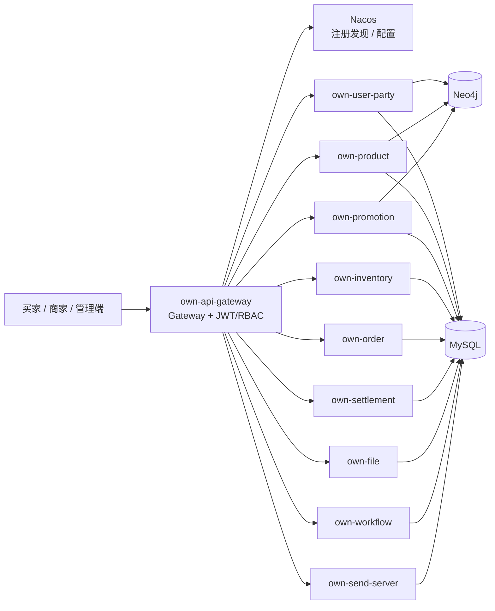

# micro-server-own

一个用于学习和演示的多商家商城微服务后端。项目覆盖账号、商品、促销、库存、订单、售后、支付与商家结算的核心交易链路，并将服务治理迁移到 Spring Cloud Alibaba + Nacos。

## 项目概览

| 项目 | 当前基线 |
| --- | --- |
| Java | 17 |
| Maven | 3.9.16（Wrapper） |
| Spring Boot | 4.0.0 |
| Spring Cloud | 2025.1.0 |
| Spring Cloud Alibaba | 2025.1.0.0 |
| 注册与配置 | Nacos 3 |
| 网关 | Spring Cloud Gateway |
| 数据库 | MySQL 5.7（交易数据）、Neo4j（既有用户/商品/促销图数据） |

## 分支说明

| 分支 | 用途 |
| --- | --- |
| `master` | 当前维护主线：Java 17、Spring Boot 4、Spring Cloud Alibaba 与 Nacos 配置基线。 |
| `jdk17` | 与当前主线同步的 Java 17 升级分支，便于独立验证与回溯升级改动。 |
| `jdk8` | Java 8 旧技术栈保留分支；不承载新的 Java 17 框架能力。 |

## 架构



## 服务说明

| 服务 | 职责 | 端口 |
| --- | --- | ---: |
| `own-api-gateway` | 统一入口、JWT/RBAC、路由与关联 ID | 9632 |
| `own-user-party` | 注册、登录、Refresh Session、角色、地址簿 | 6006 |
| `own-product` | 商品运营、分类、收藏、评价与价格审计 | 6007 |
| `own-promotion` | 促销规则、券模板、领券、占券与核销 | 6005 |
| `own-inventory` | 库存、预占、回补、调整和低库存阈值 | 6009 |
| `own-order` | 购物车、试算、拆单、履约、售后与 Outbox | 6010 |
| `own-settlement` | 模拟支付、退款、商家应收与模拟结算 | 6011 |
| `own-file` | 临时/正式文件存储与归属校验 | 6004 |
| `own-workflow` | 业务流程与状态记录 | 6008 |
| `own-send-server` | 短信、邮件、推送的服务适配 | 6003 |

## 已实现业务

- 买家注册、BCrypt 登录、HS256 JWT、Refresh Session 轮换与撤销、登录失败保护。
- 网关路由 RBAC：`ROLE_BUYER`、`ROLE_MERCHANT`、`ROLE_SYSTEM`；服务间请求使用独立内部令牌。
- 商品以 Product 为可售 SKU：商家创建、编辑、上下架，买家浏览、收藏、评价与举报。
- 地址簿、购物车、实时价格校验、按商家拆单、固定运费和免邮门槛。
- 库存悲观锁预占、支付确认、超时释放、退款/换货回补、人工调整和审计台账。
- 平台券、店铺券、用户券实例、领券、占用、核销与释放。
- 模拟支付和退款、商家发货、物流轨迹、签收、自动签收、退款/退货退款/同 SKU 换货。
- 订单状态事件写入 Outbox；未配置投递目标时保留待投递状态，不伪造投递成功。
- 可选 RocketMQ Outbox 发布：启用后由持久化 Outbox 异步发送订单事件；消费者必须以事件 ID 写入 Inbox 去重。
- 商家应收、结算周期与模拟提现；真实微信/支付宝渠道参数通过环境变量配置。

## 交易一致性进度

交易服务采用“本地事务 + 幂等 + Outbox + Inbox + Saga 补偿”的最终一致性方向；不将 Neo4j、支付渠道、文件或物流操作纳入全局数据库事务。

| 能力 | 当前状态 | 说明 |
| --- | --- | --- |
| 本地事务与幂等 | 已实现 | 写请求使用 `Idempotency-Key`，库存、券、支付与退款路径具有本地幂等保护。 |
| 库存/优惠券补偿 | 已实现于同步链路 | 下单、取消、超时、支付、退款和售后路径具备预占、确认、释放或回补逻辑。 |
| Outbox | 已实现 | 订单状态与事件同事务写入 `ord_event`；失败按退避重试，未配置目标时保持待投递。 |
| RocketMQ 发布 | 已实现，默认关闭 | 设置 `TRADE_OUTBOX_ROCKETMQ_ENABLED=true` 后，Outbox 调度器可向 `trade.order.events` 发布事件。 |
| Inbox 去重 | 基础设施已实现 | 库存、促销、结算服务使用 `trade_message_inbox` 按消费者和事件 ID 去重。 |
| 异步下单 Saga | 已实现（服务级） | 下单先持久化为 `PROCESSING`，工作器按“库存预占 → 优惠券预占”推进；成功后才转 `PENDING_PAYMENT` 并删除所选购物车项。 |
| Saga 补偿 | 已实现（服务级） | 任一步失败进入 `COMPENSATING`，释放优惠券与库存成功后才转 `SAGA_FAILED`；补偿失败会按 `trade.saga.retry-seconds` 重试，购物车保留。 |
| 事件驱动 Saga | 未完成 | RocketMQ 目前只承载订单 Outbox 的可选发布；库存/促销的业务消费者、结果事件、死信和对账尚未接入，不能称为端到端消息 Saga。 |

`TRADE_SAGA_ASYNC_ENABLED=true`（默认）启用该持久化工作器；可用 `TRADE_SAGA_DELAY_MILLIS` 与 `TRADE_SAGA_RETRY_SECONDS` 调整扫描与补偿重试。它通过现有内部服务幂等接口工作，不把远程调用伪装为单个数据库事务。

因此，当前 RocketMQ 与 Inbox 不能表述为已完成的端到端分布式事务。它们仍是后续消息驱动 Saga 的可靠消息基础。

## 快速开始

### 1. 准备环境

- JDK 17
- Docker Compose v2（运行整套环境时需要）
- MySQL、Neo4j、Nacos 的可访问实例，或使用 Compose 编排

### 2. 构建与测试

```bash
JAVA_HOME=<jdk17> ./mvnw -B -ntp clean verify
git diff --check
```

根 `pom.xml` 是唯一的版本治理入口。新增依赖或插件时，先在根 POM 管理版本，再由子模块引用；子模块不重复声明项目版本或受管版本。

### 3. 配置 Nacos

复制并填写环境变量：

```bash
cp .env.example .env
```

启动 Nacos 后，导入仓库中的 Data ID：

```bash
export NACOS_SERVER=http://localhost:8848
export NACOS_USERNAME=nacos
export NACOS_PASSWORD='<nacos-password>'
bash scripts/import-nacos-config.sh
```

配置文件位于 [`deploy/nacos/config`](deploy/nacos/config)。默认 Group 为 `MICRO_SERVER`、Namespace 为 `public`，服务通过 `spring.config.import` 加载 `own-<service>-local.yaml`。

### 4. 数据库迁移

新库可由 Compose 初始化；已有 MySQL 库请先备份，再运行前向迁移：

```bash
MYSQL_HOST=<host> MYSQL_PORT=3306 MYSQL_USER=<user> \
MYSQL_PASSWORD='<password>' MYSQL_DATABASE=micro \
  bash scripts/apply-migrations.sh
```

Neo4j 图数据升级步骤见 [Neo4j 数据访问现代化运行手册](docs/architecture/neo4j-modernization-runbook.md)。先在隔离副本执行备份恢复、图计数比对和业务回归，再切换服务配置。

### 5. 本地启动

先启动 Nacos、MySQL 和 Neo4j，导入 Nacos 配置后，按依赖顺序启动：

1. `own-user-party`、`own-product`、`own-promotion`
2. `own-file`、`own-send-server`、`own-workflow`
3. `own-inventory`、`own-order`、`own-settlement`
4. `own-api-gateway`

单个服务示例：

```bash
JAVA_HOME=<jdk17> ./mvnw -pl own-order -am spring-boot:run
```

网关入口默认为 `http://localhost:9632`。网关将 `/user/**`、`/product/**`、`/sale/**`、`/inventory/**`、`/order/**`、`/settlement/**` 路由到对应服务。

## 关键配置

| 配置 | 用途 |
| --- | --- |
| `NACOS_SERVER_ADDR`、`NACOS_USERNAME`、`NACOS_PASSWORD` | Nacos 注册与配置中心 |
| `MYSQL_URL`、`MYSQL_USER`、`MYSQL_PASSWORD` | MySQL 连接 |
| `NEO4J_URI`、`NEO4J_USER`、`NEO4J_PASSWORD` | Neo4j Bolt 连接 |
| `JWT_SECRET`、`JWT_PREVIOUS_SECRET` | JWT 签名与轮换 |
| `INTERNAL_SERVICE_TOKEN` | 服务间内部接口令牌 |
| `PAYMENT_CHANNEL` | 支付模式；默认模拟渠道 |
| `WECHAT_*`、`ALIPAY_*` | 微信、支付宝渠道配置 |
| `ORDER_OUTBOX_WEBHOOK_URL`、`ORDER_OUTBOX_WEBHOOK_SECRET` | 可选的订单事件投递目标 |
| `TRADE_OUTBOX_ROCKETMQ_ENABLED`、`ROCKETMQ_NAMESRV_ADDR` | RocketMQ 订单事件发布开关与 NameServer；默认关闭 |

完整模板见 [`.env.example`](.env.example)。密钥只能通过环境变量、Secret 管理或受控部署系统提供，不能提交到仓库。

## 部署

Compose 文件仍保留为旧版 Eureka / Config Server 基础设施迁移对照，不能用于验证当前 Nacos + RocketMQ 目标架构。当前 Spring Cloud Alibaba 服务应使用 Nacos 配置启动。可按以下方式部署到目标环境：

1. 部署受控的 MySQL、Neo4j 和 Nacos，并完成数据库备份与恢复演练。
2. 使用 `scripts/apply-migrations.sh` 执行 MySQL 前向迁移，使用 Neo4j 运行手册完成图数据副本验证。
3. 将 Nacos 配置导入目标 Namespace/Group，并通过 Secret 注入数据库、JWT、内部令牌和支付渠道密钥。
4. 构建各模块镜像，先启动领域服务并确认已注册至 Nacos，再启动 Gateway。
5. 仅公开 Gateway；数据库、Nacos 和业务服务置于私有网络，前置 HTTPS、反向代理、WAF、日志与指标采集。
6. 发布后验证登录、下单、库存、支付回调、退款、Outbox 积压和备份恢复。

## 验证边界

本仓库的 Maven 测试用于验证代码、单元契约和构建。Nacos、RocketMQ、MySQL、Neo4j、支付渠道、物流、消息投递与容器编排需要在实际目标环境进行集成验收。当前实施进度与待验证项见 [框架升级与业务迁移计划](docs/architecture/framework-upgrade-plan.md)。

## 文档

- [框架升级与业务迁移计划](docs/architecture/framework-upgrade-plan.md)
- [框架升级兼容性基线](docs/architecture/framework-upgrade-inventory.md)
- [Neo4j 数据访问现代化运行手册](docs/architecture/neo4j-modernization-runbook.md)
- [Nacos 配置交付](deploy/nacos/README.md)
- [商城能力路线图](docs/product/mall-capability-roadmap.md)
- [生产部署与渠道接入计划](docs/production-deployment-plan.md)

## 许可证

仓库现有许可证文件内容异常，本文档不作额外授权或商业使用承诺。
