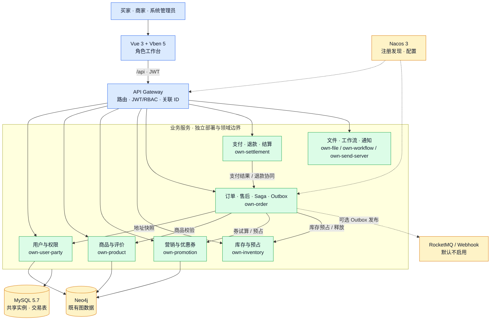
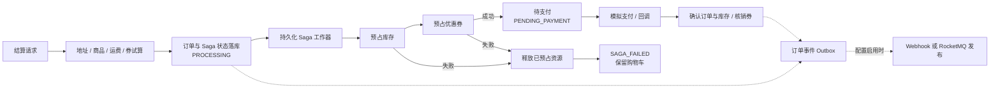
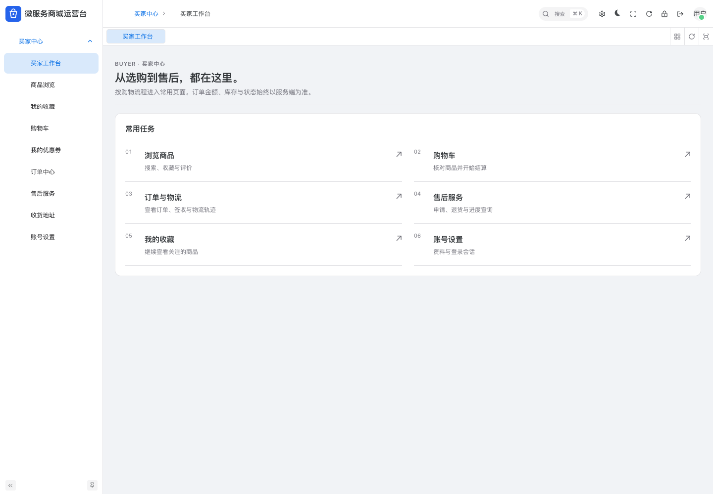
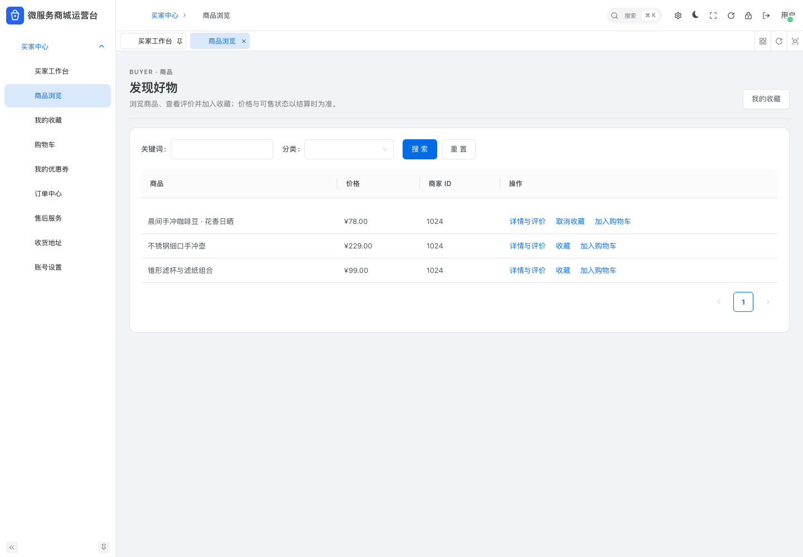
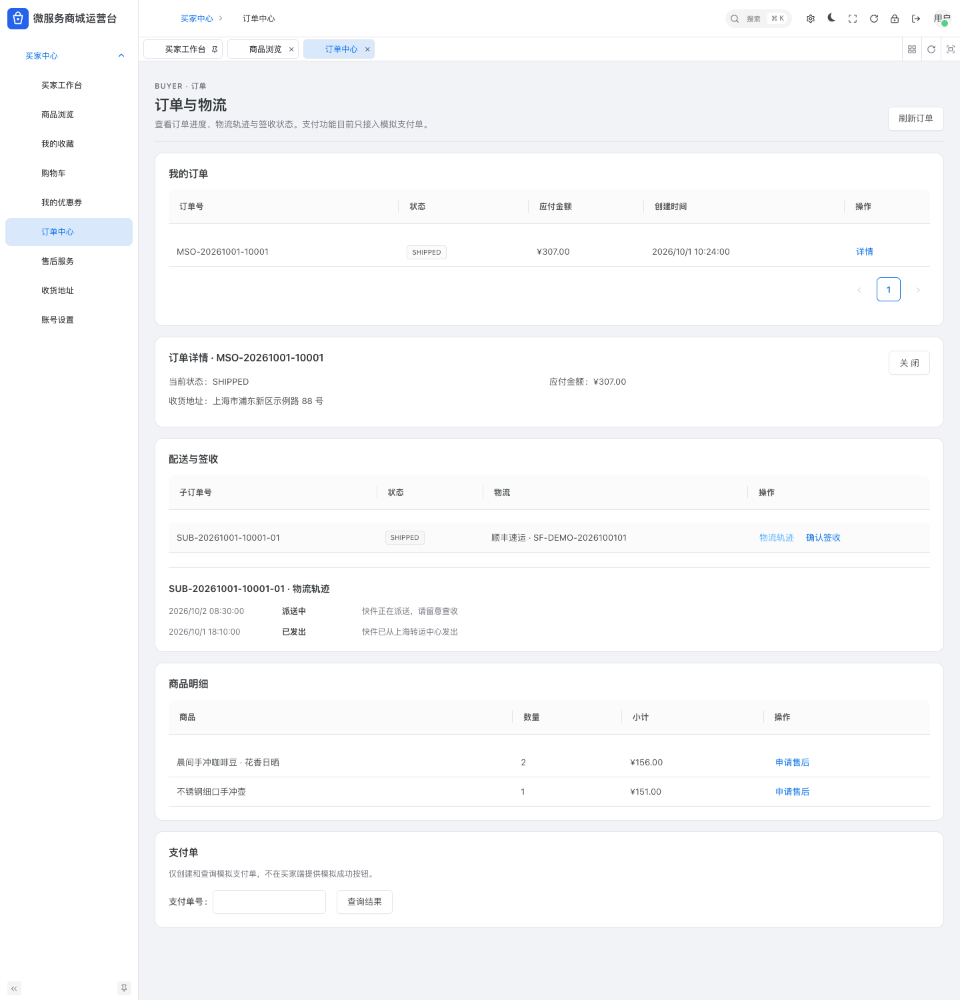
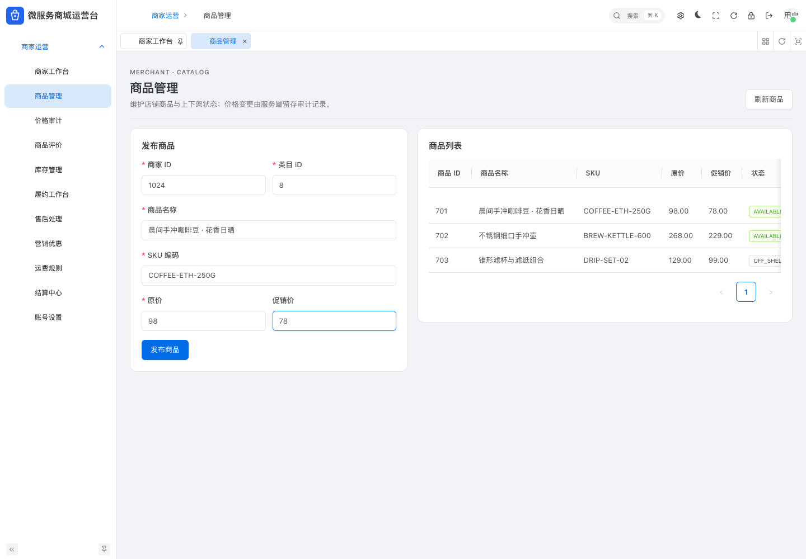
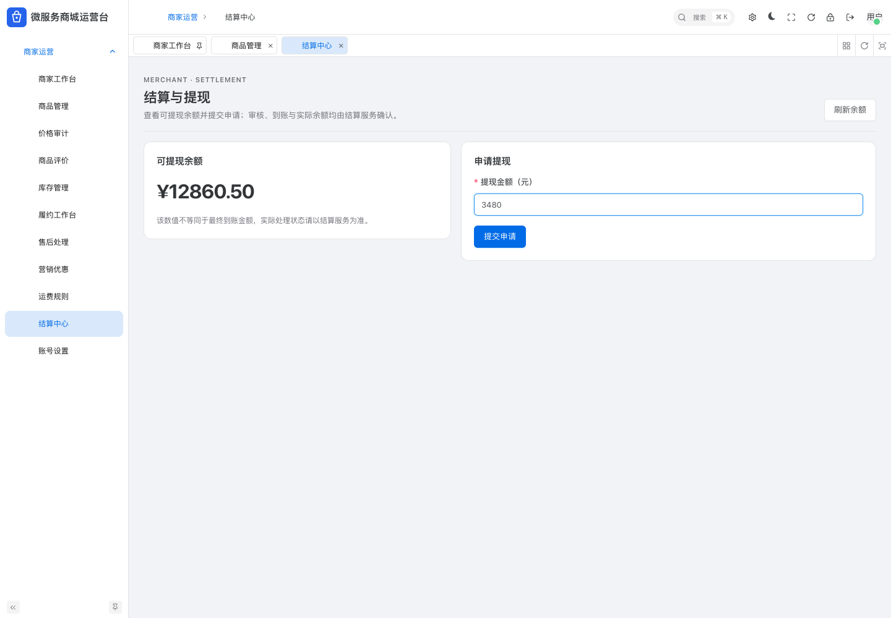
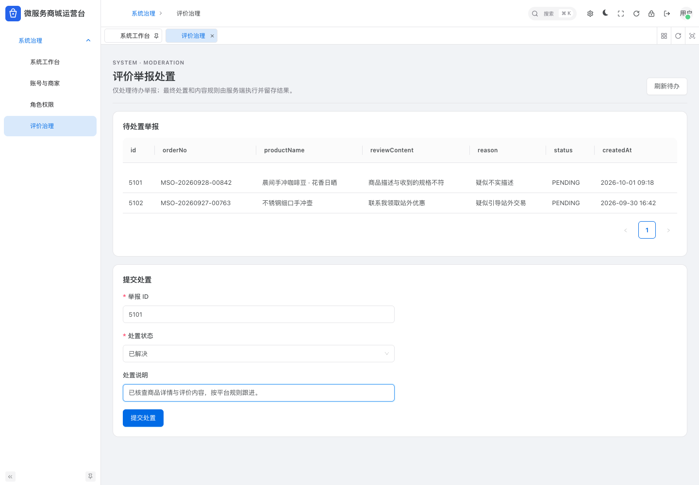

# micro-server-own · 微服务商城

[](https://openjdk.org/projects/jdk/17/)
[](https://spring.io/projects/spring-boot)
[](https://sca.aliyun.com/)
[](https://vuejs.org/)
[](https://www.vben.pro/)
[](https://github.com/Blucezhang/micro-server-own/stargazers)
[](https://github.com/Blucezhang/micro-server-own/network/members)
[](LICENSE)

**简体中文** · [English](README_EN.md)

> 一个面向学习、演示与演进实践的多商家商城微服务项目。项目以 Java 17、Spring Cloud Alibaba、Nacos 和 Vben Admin 5 为当前基线，覆盖从账户、商品与营销，到库存、订单、支付、售后和商家结算的核心交易链路。


## 从这里开始

| 你想了解 | 直接前往 |
| --- | --- |
| 项目能做什么、还缺什么 | [功能交付状态](#功能交付状态) · [近期优化顺序](#近期优化顺序) |
| 服务如何协作 | [架构概览](#架构概览) · [服务地图](#服务地图) |
| 如何本地运行与验收 | [快速开始](#快速开始) · [验证边界](#验证边界) · [常见问题](#常见问题) |
| 如何参与 | [贡献指南](CONTRIBUTING.md) · [文档索引](#文档) |

> **交付说明：** 这是可运行、可持续完善的工程实践项目，不是已通过真实支付、物流和生产环境验收的商城成品。下方“已实现”只描述代码能力；真实依赖与渠道验证另行列明。

## 项目定位

`micro-server-own` 将商城交易中常见的领域拆分为可独立运行、可组合验证的服务：买家下单与售后、商家商品运营和履约、平台账号与内容治理，以及相应的库存、券、支付和结算协同。

项目保留了清晰的工程边界：本地事务、幂等、Outbox、Inbox 与 Saga 补偿是当前一致性实现方向；真实支付、物流、消息消费者和生产部署仍需要在目标环境完成集成验收。

## 技术基线

| 分类 | 当前选择 |
| --- | --- |
| 后端语言与构建 | Java 17、Maven Wrapper 3.9.16 |
| 应用框架 | Spring Boot 4.0.0、Spring Cloud 2025.1.0 |
| 服务治理 | Spring Cloud Alibaba 2025.1.0.0、Nacos 3 |
| 网关与安全 | Spring Cloud Gateway、JWT、RBAC、内部服务令牌 |
| 数据存储 | MySQL 5.7（交易数据）、Neo4j（既有用户/商品/促销图数据） |
| 前端 | Vue 3、TypeScript、Vite、Vben Admin 5 |
| 异步能力 | Outbox、Inbox；可选 RocketMQ 订单事件发布 |

## 核心能力

- **多角色门户**：买家、商家、系统管理员基于 `ROLE_BUYER`、`ROLE_MERCHANT`、`ROLE_SYSTEM` 隔离路由与工作台。
- **核心交易主链路**：地址簿、购物车、价格校验、按商家拆单、运费、库存预占、模拟支付确认、发货、签收、售后和模拟结算；真实依赖验收尚未完成。
- **商品与营销运营**：商品发布/编辑、上下架、收藏、评价举报、价格审计、平台券、店铺券、领券、占券和核销。
- **交易可靠性**：写请求使用 `Idempotency-Key`；库存、优惠券、支付与退款在本地边界内处理幂等、确认、释放与回补。
- **可验收前端**：内置 Vben 5 商城控制台，开发模式提供纯浏览器内的三类角色 UI 演示入口，不依赖真实账户或后端写入。

## 功能交付状态

“代码已实现”不等于真实数据库或渠道验收通过；下表分别说明后端与当前商城前端，不把上游 Vben 示例页面视为已接入业务。

| 领域 | 后端能力 | 当前商城前端 / 缺口 |
| --- | --- | --- |
| 购物与交易 | 商品、购物车、地址、试算、拆单、库存/券预占、订单与售后状态机 | 已有浏览、地址、购物车、结算、订单和售后页面；真实交易回归待验收 |
| 商品运营 | 商品创建/编辑、上下架、价格审计 | 已有页面；编辑取消/保存后重置，相同内容失败重试复用幂等键，长表格容器内滚动 |
| 优惠券 | 商家模板、买家领取/持有、试算、预占和核销 | 商家模板、买家券包、凭已知模板 ID 领店铺券与结算单券试算/下单已接入；公开可领券列表尚无后端接口 |
| 收藏与评价 | 收藏、评价、商家回复、举报及治理接口 | 买家收藏清单、商品评价/举报、商家回复与系统评价治理页已接入；真实后端联调待验收 |
| 账号与权限 | 登录、刷新、资料/会话、角色和功能授权 | 已有角色门户与受控授权；资料/会话业务页、账号/角色搜索、当前权限展示与撤权流程尚未完整交付 |
| 发货与资金 | 发货、人工物流、售后处理、模拟支付/退款、应收和提现申请 | 已有发货与结算页；商家售后工作台、买家物流轨迹入口尚缺，真实物流、付款渠道和财务对账未接入 |
| 运维可靠性 | Saga、Outbox、Inbox 基础设施、幂等记录 | 尚缺不确定幂等结果的对账恢复入口、业务消息消费者闭环和完整运维控制台 |

## 近期优化顺序

1. 对账恢复：业务结果未确认的 `PROCESSING` 幂等记录不因过期而自动重放；先核对业务记录，再人工决定恢复方式。目前没有通用恢复入口，禁止直接删记录“解除阻塞”。
2. 隔离环境联调：验证 MySQL/Neo4j 双事务管理器、批量授权回滚，以及订单、库存、券、退款的完整路径。
3. 补齐前端闭环：可领券活动列表、买家物流轨迹、商家售后、资料与会话；系统账号/角色列表与撤权；保留服务端 RBAC，不用 UI 隐藏替代授权。
4. 生产接入：真实支付/提现、物流、消息消费、监控和恢复演练，需要渠道与业务政策。

本轮前端检查、修复和验证边界见 [前端检查记录](docs/frontend/frontend-review-2026-09-30.md)；完整业务演进见 [商城能力路线图](docs/product/mall-capability-roadmap.md)。

## 架构概览

现阶段不建议仅为增加图示复杂度而重拆服务。现有边界已经覆盖身份、商品、营销、库存、订单、结算与支撑能力；更值得优先做的是集成验收、数据所有权与异步链路的闭环。下图按**入口、领域服务、服务治理和存储**展示当前实现；MySQL 是共享实例，不表示每个服务都有独立数据库。


```mermaid
flowchart TB
    actors["买家 · 商家 · 系统管理员"] --> web["Vue 3 + Vben 5<br/>角色工作台"]
    web -->|"/api · JWT"| gateway["API Gateway<br/>路由 · JWT/RBAC · 关联 ID"]

    subgraph domain["业务服务 · 独立部署与领域边界"]
      direction LR
      user["用户与权限<br/>own-user-party"]
      product["商品与评价<br/>own-product"]
      promotion["营销与优惠券<br/>own-promotion"]
      inventory["库存与预占<br/>own-inventory"]
      order["订单 · 售后 · Saga · Outbox<br/>own-order"]
      settlement["支付 · 退款 · 结算<br/>own-settlement"]
      support["文件 · 工作流 · 通知<br/>own-file / own-workflow / own-send-server"]
    end

    gateway --> user
    gateway --> product
    gateway --> promotion
    gateway --> inventory
    gateway --> order
    gateway --> settlement
    gateway --> support
    order -->|"地址快照"| user
    order -->|"商品校验"| product
    order -->|"券试算 / 预占"| promotion
    order -->|"库存预占 / 释放"| inventory
    settlement -->|"支付结果 / 退款协同"| order

    nacos["Nacos 3<br/>注册发现 · 配置"] -.-> gateway
    nacos -.-> order
    mysql[("MySQL 5.7<br/>共享实例 · 交易表")]
    neo4j[("Neo4j<br/>既有图数据")]
    domain --> mysql
    user --> neo4j
    product --> neo4j
    promotion --> neo4j
    order -.->|"可选 Outbox 发布"| mq["RocketMQ / Webhook<br/>默认不启用"]

    classDef edge fill:#dbeafe,stroke:#2563eb,color:#0f172a
    classDef business fill:#dcfce7,stroke:#16a34a,color:#0f172a
    classDef infra fill:#fef3c7,stroke:#d97706,color:#0f172a
    class actors,web,gateway edge
    class user,product,promotion,inventory,order,settlement,support business
    class nacos,mysql,neo4j,mq infra
```

实线代表当前请求或数据依赖，虚线代表治理关系或可选出口。图中只画关键调用，所有 Java 服务均接入 Nacos；RocketMQ/Webhook 发布不等于下游消费者已完成。

### 下单与一致性主链路


```mermaid
flowchart LR
    checkout["结算请求"] --> quote["地址 / 商品 / 运费 / 券试算"]
    quote --> order["订单与 Saga 状态落库<br/>PROCESSING"]
    order --> worker["持久化 Saga 工作器"]
    worker --> stock["预占库存"] --> coupon["预占优惠券"]
    coupon -->|"成功"| pending["待支付<br/>PENDING_PAYMENT"]
    stock -->|"失败"| compensate["释放已预占资源"]
    coupon -->|"失败"| compensate
    compensate --> failed["SAGA_FAILED<br/>保留购物车"]
    pending --> payment["模拟支付 / 回调"] --> paid["确认订单与库存 / 核销券"]
    order -.-> outbox["订单事件 Outbox"]
    paid -.-> outbox
    outbox -.->|"配置启用时"| publish["Webhook 或 RocketMQ 发布"]
```

图中展示的是默认启用的异步下单模式；Saga 由订单服务的持久化工作器推进，跨服务调用仍是同步 API。消息驱动的库存/营销消费者、结果事件与死信对账**尚未闭环**，不应将虚线理解为已投入运行的端到端消息 Saga。

## 服务地图

| 服务 | 主要职责 | 默认端口 |
| --- | --- | ---: |
| `own-api-gateway` | 统一入口、JWT/RBAC、路由与关联 ID | 9632 |
| `own-user-party` | 注册、登录、Refresh Session、角色、地址簿 | 6006 |
| `own-product` | 商品、分类、收藏、评价、举报与价格审计 | 6007 |
| `own-promotion` | 促销规则、券模板、领券、占券与核销 | 6005 |
| `own-inventory` | 库存、预占、确认、回补、调整与阈值 | 6009 |
| `own-order` | 购物车、试算、拆单、履约、售后与 Outbox | 6010 |
| `own-settlement` | 模拟支付、退款、商家应收与模拟结算 | 6011 |
| `own-file` | 临时/正式文件存储与归属校验 | 6004 |
| `own-workflow` | 业务流程与状态记录 | 6008 |
| `own-send-server` | 短信、邮件、推送适配 | 6003 |

## 前端工作台

前端工程位于 [`micro-server-own-web-vben`](micro-server-own-web-vben)，以 Vue 3、TypeScript、Vite 和 Vben Admin 5 实现。

| 门户 | 页面范围 |
| --- | --- |
| 买家 | 商品浏览与评价/举报、收藏、购物车、地址簿、券包与凭 ID 领券、结算选券、订单/支付、售后 |
| 商家 | 商品发布/编辑、评价回复、价格审计、库存、履约发货、优惠券、运费、结算提现 |
| 系统 | 账号/商家角色授权、角色功能授权、评价举报治理 |

### 页面展示

以下截图来自本地 Vben 前端，以浏览器内的虚构商品、订单、物流、举报和结算数据生成；不连接真实业务 API，也没有提交任何写操作。页面覆盖三个门户及常用交易、运营和治理场景。

| 买家工作台 | 买家商品目录 |
| --- | --- |
|  |  |

| 买家订单详情与物流轨迹 | 商家商品管理 |
| --- | --- |
|  |  |

| 商家结算提现 | 系统评价举报治理 |
| --- | --- |
|  |  |

截图数据仅用于展示界面布局和交互入口，不代表实际商品、订单、物流状态、审核结论或账户余额。页面功能与后端联调边界见上方“功能交付状态”。

开发模式下，登录页的“买家演示 / 商家演示 / 系统演示”只在浏览器中创建临时身份，方便 UI 验收；演示登录本身不会调用网关或写入真实业务数据。进入业务页后仍需后端接口或隔离模拟 API，生产构建中不显示这些入口。

## 分支说明

| 分支 | 用途 |
| --- | --- |
| `master` | 远程默认分支；以仓库当前提交和 CI 结果为准。 |
| `jdk17` | 本轮前端开发与验证所在分支；不预设它与 `master` 始终同步。 |

## 快速开始

### 1. 准备环境

- JDK 17
- Docker Compose v2（运行整套环境时需要）
- 可访问的 MySQL、Neo4j、Nacos 实例，或使用 Compose 编排
- Node.js 22.18+ 或 24.12+（运行 Vben 前端时需要）
- pnpm 11.16.0（下方命令通过 `npx` 固定版本；不要用旧 pnpm 或 npm 重写工作区锁文件）

### 2. 构建后端

```bash
JAVA_HOME=<jdk17> ./mvnw -B -ntp clean verify
git diff --check
```

根 `pom.xml` 是版本治理入口；新增依赖或插件应先在根 POM 管理版本，再由子模块引用。

### 3. 启动基础设施并导入配置

```bash
cp .env.example .env
docker compose --env-file .env up -d mysql neo4j nacos
set -a && . ./.env && set +a
export NACOS_SERVER=http://localhost:8848
bash scripts/import-nacos-config.sh
```

本机 Compose 的 Nacos 默认关闭认证，只适用于开发演示。Nacos 配置在 [`deploy/nacos/config`](deploy/nacos/config)，默认使用 `MICRO_SERVER` Group 与 `public` Namespace。

### 4. 迁移数据库

新库可由 Compose 初始化；已有 MySQL 数据库必须先备份，再执行前向迁移：

```bash
MYSQL_HOST=<host> MYSQL_PORT=3306 MYSQL_USER=<user> \
MYSQL_PASSWORD='<password>' MYSQL_DATABASE=micro \
  bash scripts/apply-migrations.sh
```

Neo4j 图数据升级请遵循 [Neo4j 数据访问现代化运行手册](docs/architecture/neo4j-modernization-runbook.md)：在隔离副本完成恢复、计数比对和业务回归后再切换服务配置。

### 5. 启动后端服务

导入 Nacos 配置后，建议按下面的依赖顺序启动：

1. `own-user-party`、`own-product`、`own-promotion`
2. `own-file`、`own-send-server`、`own-workflow`
3. `own-inventory`、`own-order`、`own-settlement`
4. `own-api-gateway`

单服务启动示例：

```bash
java -jar own-order/target/own-order-1.0-ALPHA.jar
```

网关入口默认为 `http://localhost:9632`，负责 `/user/**`、`/product/**`、`/sale/**`、`/inventory/**`、`/order/**`、`/settlement/**` 的路由。

### 6. 启动前端

Vite 默认将 `/api` 代理到网关 `http://localhost:9632`：

```bash
cd micro-server-own-web-vben
npx -y pnpm@11.16.0 install --frozen-lockfile
npx -y pnpm@11.16.0 --filter @vben/web-antd run dev --host 127.0.0.1
```

默认访问 `http://127.0.0.1:5176/auth/login`，实际端口以启动输出为准。UI 演示入口无需账号密码，但业务数据仍需本地网关或隔离模拟 API。以下检查在前端工作区根目录运行；新终端先执行 `cd micro-server-own-web-vben`：

```bash
npx -y pnpm@11.16.0 --filter @vben/web-antd run typecheck
npx -y pnpm@11.16.0 exec vitest run apps/web-antd/src/api/marketplace-*.test.ts
npx -y pnpm@11.16.0 --filter @vben/web-antd run build
```

## 交易一致性状态

交易服务采用“本地事务 + 幂等 + Outbox + Inbox + Saga 补偿”的最终一致性方向；Neo4j、支付渠道、文件和物流操作不被伪装为全局数据库事务。

| 能力 | 当前状态 | 说明 |
| --- | --- | --- |
| 本地事务与幂等 | 已实现，有限边界 | 相同内容同键重放响应，不同内容同键返回 409。已完成记录按保留期过期；不确定的 PROCESSING 记录不会因过期被自动删除。跨库不保证 exactly-once。 |
| 库存/优惠券补偿 | 已实现于同步链路 | 下单、取消、超时、支付、退款和售后具备预占、确认、释放或回补逻辑。 |
| Outbox | 已实现 | 订单状态与事件同事务写入 `ord_event`；失败按退避重试。 |
| RocketMQ 发布 | 已实现，默认关闭 | `TRADE_OUTBOX_ROCKETMQ_ENABLED=true` 时向 `trade.order.events` 发布订单事件。 |
| Inbox 去重 | 基础设施已实现 | 库存、促销、结算服务按消费者和事件 ID 去重。 |
| 异步下单与补偿 | 已实现（服务级） | `PROCESSING` 状态按库存预占、优惠券预占推进；失败进入补偿，购物车保留。 |
| 端到端消息 Saga | 未完成 | 库存/促销业务消费者、结果事件、死信和对账尚未接入。 |

`TRADE_SAGA_ASYNC_ENABLED=true`（默认）启用持久化工作器；可用 `TRADE_SAGA_DELAY_MILLIS` 与 `TRADE_SAGA_RETRY_SECONDS` 调整扫描和补偿重试。当前 RocketMQ 与 Inbox 是后续消息驱动 Saga 的基础，不应表述为完成了端到端分布式事务。

## 关键配置

| 配置 | 用途 |
| --- | --- |
| `NACOS_SERVER_ADDR`、`NACOS_USERNAME`、`NACOS_PASSWORD` | Nacos 注册与配置中心 |
| `MYSQL_URL`、`MYSQL_USER`、`MYSQL_PASSWORD` | MySQL 连接 |
| `NEO4J_URI`、`NEO4J_USER`、`NEO4J_PASSWORD` | Neo4j Bolt 连接 |
| `JWT_SECRET`、`JWT_PREVIOUS_SECRET` | JWT 签名与轮换 |
| `INTERNAL_SERVICE_TOKEN` | 服务间内部接口令牌 |
| `PAYMENT_CHANNEL` | 支付模式；默认模拟渠道 |
| `WECHAT_*`、`ALIPAY_*` | 微信、支付宝渠道配置 |
| `ORDER_OUTBOX_WEBHOOK_URL`、`ORDER_OUTBOX_WEBHOOK_SECRET` | 可选订单事件投递目标 |
| `TRADE_OUTBOX_ROCKETMQ_ENABLED`、`ROCKETMQ_NAMESRV_ADDR` | RocketMQ 订单事件发布开关与 NameServer |

完整模板见 [`.env.example`](.env.example)。密钥只能通过环境变量、Secret 管理或受控部署系统提供，不能提交到仓库。

## 部署提示

`docker-compose.yml` 使用 Nacos 3.1.1，业务镜像基于 Java 17；旧 Eureka Server 和 Config Server 已移除。生产部署应：

1. 使用受控的 MySQL、Neo4j、Nacos，并进行备份恢复演练。
2. 先执行 MySQL 前向迁移，再按照 Neo4j 手册验证图数据副本。
3. 将 Nacos 配置导入目标 Namespace/Group，并以 Secret 注入数据库、JWT、内部令牌与支付渠道密钥。
4. 先启动领域服务并确认注册至 Nacos，再启动 Gateway；仅公开 Gateway。
5. 在发布后验证登录、下单、库存、支付回调、退款、Outbox 积压与备份恢复。

## 验证边界

Maven 测试用于验证代码、单元契约和构建。Nacos、RocketMQ、MySQL、Neo4j、支付渠道、物流、消息投递和容器编排仍需在实际目标环境进行集成验收。实施进度与待验证项见 [框架升级与业务迁移计划](docs/architecture/framework-upgrade-plan.md)。

> `.github/workflows/main.yml` 已使用 JDK 17 验证 Maven 构建；远程工作流结果仍应作为合并与发布的验收依据。README 不展示可能误导的静态 CI 结论。

## 常见问题

| 现象 | 检查方式 |
| --- | --- |
| 只想看 UI，不知道账号密码 | 使用开发登录页的三个演示入口；演示不能证明真实后端业务成功 |
| “服务暂时不可用”或 `/api` 返回 502/503 | 检查网关 9632、Nacos 注册及目标服务日志；先区分代理失败、下游不可用与业务错误，不反复提交写请求 |
| 安装报锁文件不一致或 pnpm 版本错误 | 使用 pnpm 11.16.0 和 `--frozen-lockfile`；核对 Node 版本，不删除锁文件来绕过 CI |
| 写请求返回 409 / still processing | 保留原幂等键、关联 ID 和响应；核查业务结果，不换键或删除记录强行重放 |
| Mockito / Byte Buddy 无法自附加 | 可用本机实际的 `byte-buddy-agent` jar 配置 `-DargLine=-javaagent:<absolute-path>`；这不是业务服务启动参数 |

前端已移除继承模板的第三方统计脚本，并允许浏览器缩放；如需统计，须由项目维护者另行配置并明确告知用户。

## 文档

- [贡献指南](CONTRIBUTING.md)
- [行为准则](CODE_OF_CONDUCT.md)
- [支持与反馈入口](SUPPORT.md)
- [变更日志](CHANGELOG.md)
- [框架升级与业务迁移计划](docs/architecture/framework-upgrade-plan.md)
- [框架升级兼容性基线](docs/architecture/framework-upgrade-inventory.md)
- [Neo4j 数据访问现代化运行手册](docs/architecture/neo4j-modernization-runbook.md)
- [Nacos 配置交付](deploy/nacos/README.md)
- [商城能力路线图](docs/product/mall-capability-roadmap.md)
- [前端检查记录与剩余功能](docs/frontend/frontend-review-2026-09-30.md)
- [前端项目交接说明](docs/frontend/frontend-project-brief.md)
- [生产部署与渠道接入计划](docs/production-deployment-plan.md)

## 许可证

本项目采用 [Apache License 2.0](LICENSE)。使用、修改和再分发时，请遵守该许可证的条款，并保留适用的版权、专利、商标和归属声明。

内置 Vben 及其他第三方代码保留各自许可证与归属（Vben 前端为 MIT）；仓库根许可证不替代第三方许可证。
