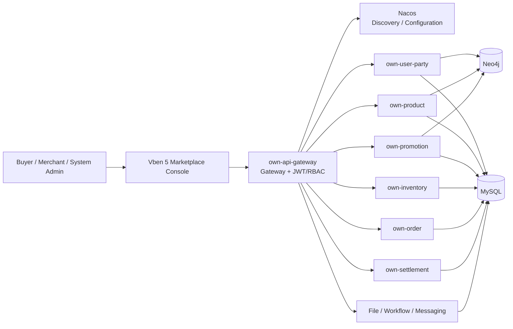

# micro-server-own

[](https://openjdk.org/projects/jdk/17/)
[](https://spring.io/projects/spring-boot)
[](https://sca.aliyun.com/)
[](https://vuejs.org/)
[](https://www.vben.pro/)
[](https://github.com/Blucezhang/micro-server-own/stargazers)
[](https://github.com/Blucezhang/micro-server-own/network/members)
[](#license)

[简体中文](README.md) · English

> A multi-merchant marketplace microservices project for learning, demonstration, and incremental engineering practice. Its current baseline is Java 17, Spring Cloud Alibaba, Nacos, and Vben Admin 5, covering accounts, catalog, promotions, inventory, orders, payments, after-sales, and merchant settlement.

## Project scope

`micro-server-own` separates common marketplace domains into independently runnable and verifiable services: buyer ordering and after-sales, merchant catalog operations and fulfillment, platform account and content governance, plus inventory, coupon, payment, and settlement coordination.

Local transactions, idempotency, Outbox, Inbox, and Saga compensation define the current consistency direction. Real payment providers, logistics, message consumers, and production deployment still require integration acceptance in the target environment.

## Technology baseline

| Area | Current choice |
| --- | --- |
| Backend and build | Java 17, Maven Wrapper 3.9.16 |
| Application framework | Spring Boot 4.0.0, Spring Cloud 2025.1.0 |
| Service governance | Spring Cloud Alibaba 2025.1.0.0, Nacos 3 |
| Gateway and security | Spring Cloud Gateway, JWT, RBAC, internal service token |
| Data stores | MySQL 5.7 for transactions; Neo4j for existing user, catalog, and promotion graph data |
| Frontend | Vue 3, TypeScript, Vite, Vben Admin 5 |
| Async foundation | Outbox and Inbox; optional RocketMQ order-event publishing |

## Capabilities

- **Role-specific portals** for buyers, merchants, and system administrators through `ROLE_BUYER`, `ROLE_MERCHANT`, and `ROLE_SYSTEM`.
- **Marketplace transaction flow** covering addresses, cart, price checks, merchant-level order splitting, shipping, stock reservation, payment confirmation, fulfillment, receipt, after-sales, and settlement.
- **Catalog and promotion operations** including product publishing/editing, shelf status, favorites, review reports, price audit, platform/store coupons, claiming, reservation, and redemption.
- **Transaction safeguards** using `Idempotency-Key`, with local handling for inventory, coupons, payments, and refunds.
- **UI review mode**: the Vben 5 console includes browser-only role demos in development mode, so a UI review does not require a live account or backend writes.

## Architecture



## Service map

| Service | Responsibility | Default port |
| --- | --- | ---: |
| `own-api-gateway` | Unified entry point, JWT/RBAC, routing, correlation ID | 9632 |
| `own-user-party` | Registration, login, refresh sessions, roles, addresses | 6006 |
| `own-product` | Products, categories, favorites, reviews, reports, price audit | 6007 |
| `own-promotion` | Promotion rules, coupon templates, claim, reserve, redeem | 6005 |
| `own-inventory` | Stock, reservation, confirmation, replenishment, adjustment, thresholds | 6009 |
| `own-order` | Cart, quotation, splitting, fulfillment, after-sales, Outbox | 6010 |
| `own-settlement` | Simulated payments, refunds, merchant receivables, simulated settlement | 6011 |
| `own-file` | Temporary/final file storage and ownership checks | 6004 |
| `own-workflow` | Business flow and status records | 6008 |
| `own-send-server` | SMS, email, and push adapters | 6003 |

## Frontend consoles

The Vue application lives in [`micro-server-own-web-vben`](micro-server-own-web-vben).

| Portal | Main pages |
| --- | --- |
| Buyer | Catalog, cart, addresses, checkout, orders/payments, after-sales |
| Merchant | Product publishing/editing, price audit, inventory, shipment, coupons, freight, settlement/withdrawal |
| System | Account and merchant-role assignment, role permissions, review/report governance |

The development login page exposes Buyer, Merchant, and System demos. They create a temporary browser-only identity for UI review, do not call the gateway or write business data, and are excluded from production builds.

## Branches

| Branch | Purpose |
| --- | --- |
| `master` | Maintained mainline: Java 17, Spring Boot 4, Spring Cloud Alibaba, and Nacos baseline. |
| `jdk17` | Java 17 upgrade branch kept in sync with `master` for isolated verification and historical tracing. |

## Quick start

### Prerequisites

- JDK 17
- Docker Compose v2 for the full stack
- Reachable MySQL, Neo4j, and Nacos instances, or the Compose stack
- Node.js 22.18+ or 24.12+ for the Vben frontend

### Build the backend

```bash
JAVA_HOME=<jdk17> ./mvnw -B -ntp clean verify
git diff --check
```

The root `pom.xml` is the version-management entry point. Manage new dependency or plugin versions there before referencing them from submodules.

### Start infrastructure and import configuration

```bash
cp .env.example .env
docker compose --env-file .env up -d mysql neo4j nacos
set -a && . ./.env && set +a
export NACOS_SERVER=http://localhost:8848
bash scripts/import-nacos-config.sh
```

The local Compose Nacos instance has authentication disabled and is for development only. Configuration files are in [`deploy/nacos/config`](deploy/nacos/config), using the `MICRO_SERVER` group and `public` namespace by default.

### Migrate databases

Compose can initialize a new database. Back up an existing MySQL database before applying forward migrations:

```bash
MYSQL_HOST=<host> MYSQL_PORT=3306 MYSQL_USER=<user> \
MYSQL_PASSWORD='<password>' MYSQL_DATABASE=micro \
  bash scripts/apply-migrations.sh
```

For Neo4j graph data, follow the [Neo4j data-access modernization runbook](docs/architecture/neo4j-modernization-runbook.md): restore and compare an isolated copy, then run business regression checks before switching service configuration.

### Start backend services

After importing Nacos configuration, start services in this order:

1. `own-user-party`, `own-product`, `own-promotion`
2. `own-file`, `own-send-server`, `own-workflow`
3. `own-inventory`, `own-order`, `own-settlement`
4. `own-api-gateway`

For example:

```bash
JAVA_HOME=<jdk17> ./mvnw -pl own-order -am spring-boot:run
```

The gateway is available at `http://localhost:9632` and routes `/user/**`, `/product/**`, `/sale/**`, `/inventory/**`, `/order/**`, and `/settlement/**`.

### Start the frontend

Vite proxies `/api` to the gateway at `http://localhost:9632` by default:

```bash
cd micro-server-own-web-vben/apps/web-antd
npm run dev
```

Open `http://127.0.0.1:5176/auth/login`. Run frontend static checks with:

```bash
cd micro-server-own-web-vben
npx -y pnpm@11.16.0 --filter @vben/web-antd run typecheck
npx -y pnpm@11.16.0 --filter @vben/web-antd run build
```

## Transaction consistency status

| Capability | Status | Notes |
| --- | --- | --- |
| Local transactions and idempotency | Implemented | Write requests use `Idempotency-Key`; inventory, coupons, payments, and refunds have local idempotency protection. |
| Inventory/coupon compensation | Implemented in synchronous flows | Order, cancellation, timeout, payment, refund, and after-sales flows reserve, confirm, release, or replenish resources. |
| Outbox | Implemented | Order states/events are stored in `ord_event` in the local transaction and retried with backoff. |
| RocketMQ publishing | Implemented, disabled by default | Set `TRADE_OUTBOX_ROCKETMQ_ENABLED=true` to publish to `trade.order.events`. |
| Inbox deduplication | Infrastructure implemented | Inventory, promotion, and settlement deduplicate by consumer and event ID. |
| Async order Saga and compensation | Implemented at service level | `PROCESSING` advances through stock and coupon reservation; failure compensates resources and preserves the cart. |
| End-to-end message Saga | Not complete | Domain consumers, result events, DLQ handling, and reconciliation are not connected. |

`TRADE_SAGA_ASYNC_ENABLED=true` enables the persistent worker by default. `TRADE_SAGA_DELAY_MILLIS` and `TRADE_SAGA_RETRY_SECONDS` control scans and compensation retries. RocketMQ and Inbox are foundations for a future message-driven Saga, not proof of an end-to-end distributed transaction.

## Key configuration

| Setting | Purpose |
| --- | --- |
| `NACOS_SERVER_ADDR`, `NACOS_USERNAME`, `NACOS_PASSWORD` | Nacos discovery and configuration |
| `MYSQL_URL`, `MYSQL_USER`, `MYSQL_PASSWORD` | MySQL connection |
| `NEO4J_URI`, `NEO4J_USER`, `NEO4J_PASSWORD` | Neo4j Bolt connection |
| `JWT_SECRET`, `JWT_PREVIOUS_SECRET` | JWT signing and rotation |
| `INTERNAL_SERVICE_TOKEN` | Internal service API token |
| `PAYMENT_CHANNEL` | Payment mode; simulation by default |
| `WECHAT_*`, `ALIPAY_*` | WeChat and Alipay channel configuration |
| `ORDER_OUTBOX_WEBHOOK_URL`, `ORDER_OUTBOX_WEBHOOK_SECRET` | Optional order-event delivery endpoint |
| `TRADE_OUTBOX_ROCKETMQ_ENABLED`, `ROCKETMQ_NAMESRV_ADDR` | RocketMQ publishing toggle and NameServer |

See [`.env.example`](.env.example) for the full template. Provide secrets only through environment variables, a secret manager, or a controlled deployment system; never commit them.

## Deployment and verification

`docker-compose.yml` uses Nacos 3.1.1 and Java 17 application images; the legacy Eureka Server and Config Server were removed. Production deployments should use managed MySQL, Neo4j, and Nacos; perform migration and recovery exercises; inject secrets securely; start domain services before Gateway; and expose Gateway only.

Maven tests verify source code, unit contracts, and the build. Nacos, RocketMQ, MySQL, Neo4j, payment channels, logistics, message delivery, and container orchestration still need integration acceptance in the target environment. See the [framework upgrade and business migration plan](docs/architecture/framework-upgrade-plan.md) for current progress and open verification items.

> `.github/workflows/main.yml` is still pinned to JDK 8 and does not represent the Java 17 baseline. The README deliberately does not display a potentially misleading CI status badge.

## Documentation

- [Framework upgrade and business migration plan](docs/architecture/framework-upgrade-plan.md)
- [Framework upgrade compatibility inventory](docs/architecture/framework-upgrade-inventory.md)
- [Neo4j data-access modernization runbook](docs/architecture/neo4j-modernization-runbook.md)
- [Nacos configuration delivery](deploy/nacos/README.md)
- [Marketplace capability roadmap](docs/product/mall-capability-roadmap.md)
- [Frontend project handoff](docs/frontend/frontend-project-brief.md)
- [Production deployment and payment-channel plan](docs/production-deployment-plan.md)

## License

This repository does not currently provide an identifiable, executable open-source license text. [`LICENSE.htm`](LICENSE.htm) is not a clear grant of permission either. This README makes no additional open-source, commercial-use, or redistribution promise. Before use, distribution, or commercial deployment, the repository maintainer should add and confirm an applicable license.
