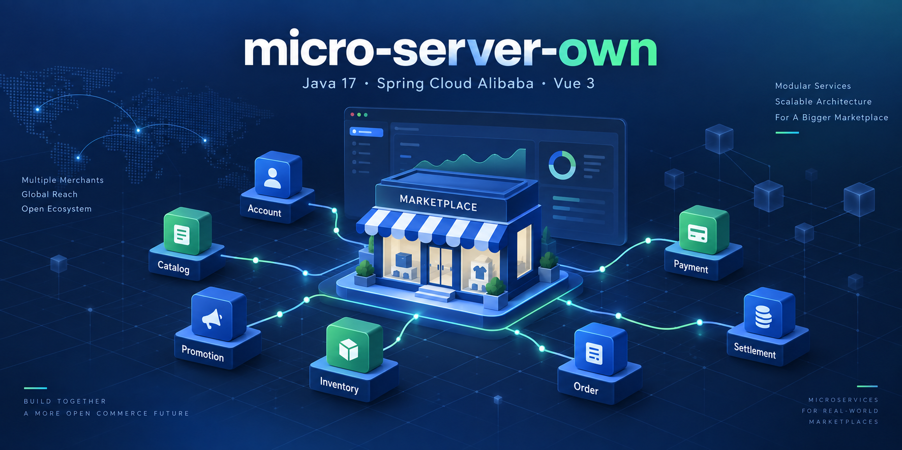
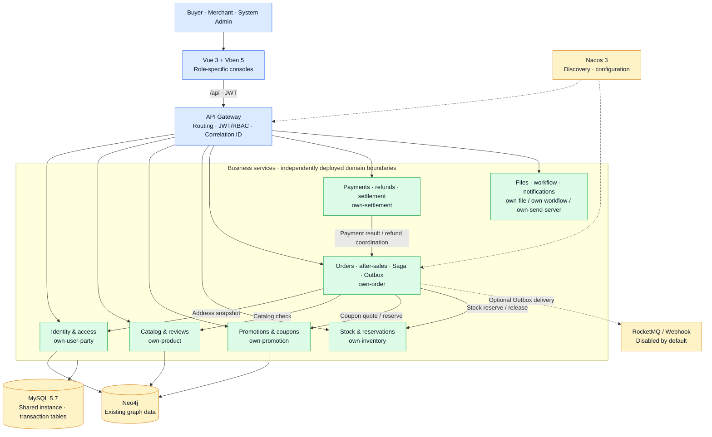
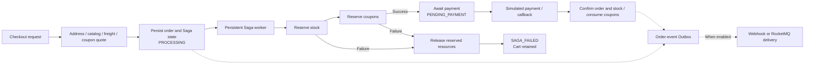

# micro-server-own · Microservices Marketplace

[](https://openjdk.org/projects/jdk/17/)
[](https://spring.io/projects/spring-boot)
[](https://sca.aliyun.com/)
[](https://vuejs.org/)
[](https://www.vben.pro/)
[](https://github.com/Blucezhang/micro-server-own/stargazers)
[](https://github.com/Blucezhang/micro-server-own/network/members)
[](LICENSE)

[简体中文](README.md) · **English**

> A multi-merchant marketplace microservices project for learning, demonstration, and incremental engineering practice. Its current baseline is Java 17, Spring Cloud Alibaba, Nacos, and Vben Admin 5, covering accounts, catalog, promotions, inventory, orders, payments, after-sales, and merchant settlement.



## Start here

| What you need | Go to |
| --- | --- |
| Capabilities and gaps | [Feature delivery status](#feature-delivery-status) · [Near-term priorities](#near-term-priorities) |
| Service relationships | [Architecture](#architecture) · [Service map](#service-map) |
| Local setup and checks | [Quick start](#quick-start) · [Verification boundaries](#verification-boundaries) · [Troubleshooting](#troubleshooting) |
| Participation | [Contribution guide](CONTRIBUTING.md) · [Documentation](#documentation) |

> **Delivery note:** This is a runnable, evolving engineering project—not a marketplace accepted against real payment, logistics, or production environments. “Implemented” below refers to code capability; external integration evidence is stated separately.

## Project scope

`micro-server-own` separates common marketplace domains into independently runnable and verifiable services: buyer ordering and after-sales, merchant catalog operations and fulfillment, platform account and content governance, plus inventory, coupon, payment, and settlement coordination.

Local transactions, idempotency, Outbox, Inbox, and Saga compensation define the current consistency direction. Real payment providers, logistics, message consumers, and production deployment still require integration acceptance in the target environment.

## Technology baseline

| Area | Current choice |
| --- | --- |
| Backend and build | Java 17, Maven Wrapper 3.9.16 |
| Application framework | Spring Boot 4.0.0, Spring Cloud 2025.1.0 |
| Service governance | Spring Cloud Alibaba 2025.1.0.0, Nacos 3 |
| Gateway and security | Spring Cloud Gateway, JWT, RBAC, internal service token |
| Data stores | MySQL 5.7 for transactions; Neo4j for existing user, catalog, and promotion graph data |
| Frontend | Vue 3, TypeScript, Vite, Vben Admin 5 |
| Async foundation | Outbox and Inbox; optional RocketMQ order-event publishing |

## Capabilities

- **Role-specific portals** for buyers, merchants, and system administrators through `ROLE_BUYER`, `ROLE_MERCHANT`, and `ROLE_SYSTEM`.
- **Core marketplace flow** covering addresses, cart, price checks, merchant-level splitting, freight, stock reservation, simulated payment confirmation, fulfillment, receipt, after-sales, and simulated settlement. Real-dependency acceptance remains pending.
- **Catalog and promotion operations** including product publishing/editing, shelf status, favorites, review reports, price audit, platform/store coupons, claiming, reservation, and redemption.
- **Transaction safeguards** using `Idempotency-Key`, with local handling for inventory, coupons, payments, and refunds.
- **UI review mode**: the Vben 5 console includes browser-only role demos in development mode, so a UI review does not require a live account or backend writes.

## Feature delivery status

Implemented code is not proof of acceptance against real databases or providers. This table separates backend capabilities from the current marketplace UI; upstream Vben sample pages are not treated as integrated business features.

| Area | Backend capabilities | Marketplace UI / remaining gap |
| --- | --- | --- |
| Shopping and orders | Catalog, cart, addresses, quotation, splitting, stock/coupon reservations, order/after-sales state machines | Catalog, address, cart, checkout, order and after-sales pages exist; real transaction regression remains pending |
| Catalog operations | Product creation/editing, shelf status, price audit | Pages exist; cancel/success reset the form, unchanged failed commands reuse their key, wide tables scroll within their container |
| Coupons | Merchant templates, buyer claiming/ownership, quote, reservation and redemption | Merchant templates, buyer wallet, claim by known template ID, and single-coupon checkout quotation/order are connected; no backend API lists publicly claimable offers yet |
| Favorites and reviews | Favorites, reviews, merchant replies, reporting and moderation APIs | System moderation page exists; buyer favorites/reviews and merchant replies still need UI integration |
| Accounts and access | Login, refresh, profile/sessions, role/function grants | Role portals and controlled grants exist; integrated profile/session pages, account/role search, current grants and revocation are incomplete |
| Fulfillment and money | Shipment, manual logistics, after-sales handling, simulated payments/refunds, receivables and withdrawal requests | Shipment and settlement pages exist; merchant after-sales and buyer logistics-trace screens are missing, while real logistics, payout providers and financial reconciliation are not integrated |
| Reliability and operations | Saga, Outbox, Inbox infrastructure, idempotency records | Missing uncertain-result reconciliation/recovery, complete domain message consumers and an operational console |

## Near-term priorities

1. Reconciliation: uncertain `PROCESSING` attempts must not be replayed merely because their retention time elapsed. Check business records before deciding how to recover. There is no generic recovery UI; deleting records to "unblock" writes is unsafe.
2. Isolated integration: verify MySQL/Neo4j transaction-manager selection, atomic batch grants, and order/stock/coupon/refund flows.
3. Complete frontend journeys: claimable-offer listings, buyer favorites/reviews and logistics traces, merchant after-sales, profile/sessions, and system account/role lists and revocation. UI visibility never replaces backend RBAC.
4. Production integrations: real payments/payouts, logistics, message consumption, monitoring and recovery exercises require providers and business policies.

See the [frontend review record](docs/frontend/frontend-review-2026-09-30.md) for this round's fixes and verification boundaries, and the [capability roadmap](docs/product/mall-capability-roadmap.md) for broader scope.

## Architecture

The current service boundaries do not need to be split merely to make the diagram more elaborate. Integration acceptance, data ownership, and closing the asynchronous flow are higher priorities. This view separates **entry points, domain services, service governance, and storage**. MySQL is a shared instance, not a separate database per service.


```mermaid
flowchart TB
    actors["Buyer · Merchant · System Admin"] --> web["Vue 3 + Vben 5<br/>Role-specific consoles"]
    web -->|"/api · JWT"| gateway["API Gateway<br/>Routing · JWT/RBAC · Correlation ID"]

    subgraph domain["Business services · independently deployed domain boundaries"]
      direction LR
      user["Identity & access<br/>own-user-party"]
      product["Catalog & reviews<br/>own-product"]
      promotion["Promotions & coupons<br/>own-promotion"]
      inventory["Stock & reservations<br/>own-inventory"]
      order["Orders · after-sales · Saga · Outbox<br/>own-order"]
      settlement["Payments · refunds · settlement<br/>own-settlement"]
      support["Files · workflow · notifications<br/>own-file / own-workflow / own-send-server"]
    end

    gateway --> user
    gateway --> product
    gateway --> promotion
    gateway --> inventory
    gateway --> order
    gateway --> settlement
    gateway --> support
    order -->|"Address snapshot"| user
    order -->|"Catalog check"| product
    order -->|"Coupon quote / reserve"| promotion
    order -->|"Stock reserve / release"| inventory
    settlement -->|"Payment result / refund coordination"| order

    nacos["Nacos 3<br/>Discovery · configuration"] -.-> gateway
    nacos -.-> order
    mysql[("MySQL 5.7<br/>Shared instance · transaction tables")]
    neo4j[("Neo4j<br/>Existing graph data")]
    domain --> mysql
    user --> neo4j
    product --> neo4j
    promotion --> neo4j
    order -.->|"Optional Outbox delivery"| mq["RocketMQ / Webhook<br/>Disabled by default"]

    classDef edge fill:#dbeafe,stroke:#2563eb,color:#0f172a
    classDef business fill:#dcfce7,stroke:#16a34a,color:#0f172a
    classDef infra fill:#fef3c7,stroke:#d97706,color:#0f172a
    class actors,web,gateway edge
    class user,product,promotion,inventory,order,settlement,support business
    class nacos,mysql,neo4j,mq infra
```

Solid lines show current request or data dependencies; dashed lines show governance or optional delivery. Only the principal calls are shown. Every Java service uses Nacos; publishing to RocketMQ/Webhook does not imply that downstream consumers are complete.

### Checkout and consistency flow


```mermaid
flowchart LR
    checkout["Checkout request"] --> quote["Address / catalog / freight / coupon quote"]
    quote --> order["Persist order and Saga state<br/>PROCESSING"]
    order --> worker["Persistent Saga worker"]
    worker --> stock["Reserve stock"] --> coupon["Reserve coupons"]
    coupon -->|"Success"| pending["Await payment<br/>PENDING_PAYMENT"]
    stock -->|"Failure"| compensate["Release reserved resources"]
    coupon -->|"Failure"| compensate
    compensate --> failed["SAGA_FAILED<br/>Cart retained"]
    pending --> payment["Simulated payment / callback"] --> paid["Confirm order and stock / consume coupons"]
    order -.-> outbox["Order-event Outbox"]
    paid -.-> outbox
    outbox -.->|"When enabled"| publish["Webhook or RocketMQ delivery"]
```

The diagram shows the default asynchronous ordering mode. The order service advances this Saga through a persistent worker while cross-service calls remain synchronous APIs. Message-driven stock/promotion consumers, result events, dead-letter handling, and reconciliation are **not yet an end-to-end flow**; the dashed path must not be read as a running message-based Saga.

## Service map

| Service | Responsibility | Default port |
| --- | --- | ---: |
| `own-api-gateway` | Unified entry point, JWT/RBAC, routing, correlation ID | 9632 |
| `own-user-party` | Registration, login, refresh sessions, roles, addresses | 6006 |
| `own-product` | Products, categories, favorites, reviews, reports, price audit | 6007 |
| `own-promotion` | Promotion rules, coupon templates, claim, reserve, redeem | 6005 |
| `own-inventory` | Stock, reservation, confirmation, replenishment, adjustment, thresholds | 6009 |
| `own-order` | Cart, quotation, splitting, fulfillment, after-sales, Outbox | 6010 |
| `own-settlement` | Simulated payments, refunds, merchant receivables, simulated settlement | 6011 |
| `own-file` | Temporary/final file storage and ownership checks | 6004 |
| `own-workflow` | Business flow and status records | 6008 |
| `own-send-server` | SMS, email, and push adapters | 6003 |

## Frontend consoles

The Vue application lives in [`micro-server-own-web-vben`](micro-server-own-web-vben).

| Portal | Main pages |
| --- | --- |
| Buyer | Catalog, cart, addresses, wallet/claim by ID, coupon selection at checkout, orders/payments, after-sales |
| Merchant | Product publishing/editing, price audit, inventory, shipment, coupons, freight, settlement/withdrawal |
| System | Account and merchant-role assignment, role permissions, review/report governance |

The development login page exposes Buyer, Merchant, and System demos. Demo login itself creates a temporary browser-only identity without calling Gateway or writing business data. Business pages still require backend APIs or isolated mocks. These demo entries are excluded from production builds.

## Branches

| Branch | Purpose |
| --- | --- |
| `master` | Remote default branch; use its current commits and CI results as the source of truth. |
| `jdk17` | Branch used for this frontend development and verification; it is not assumed to remain in sync with `master`. |

## Quick start

### Prerequisites

- JDK 17
- Docker Compose v2 for the full stack
- Reachable MySQL, Neo4j, and Nacos instances, or the Compose stack
- Node.js 22.18+ or 24.12+ for the Vben frontend
- pnpm 11.16.0 (pinned through `npx` below; do not rewrite the workspace lockfile with an older pnpm or npm)

### Build the backend

```bash
JAVA_HOME=<jdk17> ./mvnw -B -ntp clean verify
git diff --check
```

The root `pom.xml` is the version-management entry point. Manage new dependency or plugin versions there before referencing them from submodules.

### Start infrastructure and import configuration

```bash
cp .env.example .env
docker compose --env-file .env up -d mysql neo4j nacos
set -a && . ./.env && set +a
export NACOS_SERVER=http://localhost:8848
bash scripts/import-nacos-config.sh
```

The local Compose Nacos instance has authentication disabled and is for development only. Configuration files are in [`deploy/nacos/config`](deploy/nacos/config), using the `MICRO_SERVER` group and `public` namespace by default.

### Migrate databases

Compose can initialize a new database. Back up an existing MySQL database before applying forward migrations:

```bash
MYSQL_HOST=<host> MYSQL_PORT=3306 MYSQL_USER=<user> \
MYSQL_PASSWORD='<password>' MYSQL_DATABASE=micro \
  bash scripts/apply-migrations.sh
```

For Neo4j graph data, follow the [Neo4j data-access modernization runbook](docs/architecture/neo4j-modernization-runbook.md): restore and compare an isolated copy, then run business regression checks before switching service configuration.

### Start backend services

After importing Nacos configuration, start services in this order:

1. `own-user-party`, `own-product`, `own-promotion`
2. `own-file`, `own-send-server`, `own-workflow`
3. `own-inventory`, `own-order`, `own-settlement`
4. `own-api-gateway`

For example:

```bash
java -jar own-order/target/own-order-1.0-ALPHA.jar
```

The gateway is available at `http://localhost:9632` and routes `/user/**`, `/product/**`, `/sale/**`, `/inventory/**`, `/order/**`, and `/settlement/**`.

### Start the frontend

Vite proxies `/api` to the gateway at `http://localhost:9632` by default:

```bash
cd micro-server-own-web-vben
npx -y pnpm@11.16.0 install --frozen-lockfile
npx -y pnpm@11.16.0 --filter @vben/web-antd run dev --host 127.0.0.1
```

Open `http://127.0.0.1:5176/auth/login` by default; use the port printed by Vite. UI demo login requires no credentials, but business data still needs a local Gateway or isolated API mocks. Run these checks from the frontend workspace root; in a new shell, first run `cd micro-server-own-web-vben`:

```bash
npx -y pnpm@11.16.0 --filter @vben/web-antd run typecheck
npx -y pnpm@11.16.0 exec vitest run apps/web-antd/src/api/marketplace-*.test.ts
npx -y pnpm@11.16.0 --filter @vben/web-antd run build
```

## Transaction consistency status

| Capability | Status | Notes |
| --- | --- | --- |
| Local transactions and idempotency | Implemented with boundaries | Same-key/same-content requests replay responses; changed content returns 409. Completed records expire after retention; uncertain PROCESSING records are not automatically deleted on expiry. No cross-database exactly-once guarantee. |
| Inventory/coupon compensation | Implemented in synchronous flows | Order, cancellation, timeout, payment, refund, and after-sales flows reserve, confirm, release, or replenish resources. |
| Outbox | Implemented | Order states/events are stored in `ord_event` in the local transaction and retried with backoff. |
| RocketMQ publishing | Implemented, disabled by default | Set `TRADE_OUTBOX_ROCKETMQ_ENABLED=true` to publish to `trade.order.events`. |
| Inbox deduplication | Infrastructure implemented | Inventory, promotion, and settlement deduplicate by consumer and event ID. |
| Async order Saga and compensation | Implemented at service level | `PROCESSING` advances through stock and coupon reservation; failure compensates resources and preserves the cart. |
| End-to-end message Saga | Not complete | Domain consumers, result events, DLQ handling, and reconciliation are not connected. |

`TRADE_SAGA_ASYNC_ENABLED=true` enables the persistent worker by default. `TRADE_SAGA_DELAY_MILLIS` and `TRADE_SAGA_RETRY_SECONDS` control scans and compensation retries. RocketMQ and Inbox are foundations for a future message-driven Saga, not proof of an end-to-end distributed transaction.

## Key configuration

| Setting | Purpose |
| --- | --- |
| `NACOS_SERVER_ADDR`, `NACOS_USERNAME`, `NACOS_PASSWORD` | Nacos discovery and configuration |
| `MYSQL_URL`, `MYSQL_USER`, `MYSQL_PASSWORD` | MySQL connection |
| `NEO4J_URI`, `NEO4J_USER`, `NEO4J_PASSWORD` | Neo4j Bolt connection |
| `JWT_SECRET`, `JWT_PREVIOUS_SECRET` | JWT signing and rotation |
| `INTERNAL_SERVICE_TOKEN` | Internal service API token |
| `PAYMENT_CHANNEL` | Payment mode; simulation by default |
| `WECHAT_*`, `ALIPAY_*` | WeChat and Alipay channel configuration |
| `ORDER_OUTBOX_WEBHOOK_URL`, `ORDER_OUTBOX_WEBHOOK_SECRET` | Optional order-event delivery endpoint |
| `TRADE_OUTBOX_ROCKETMQ_ENABLED`, `ROCKETMQ_NAMESRV_ADDR` | RocketMQ publishing toggle and NameServer |

See [`.env.example`](.env.example) for the full template. Provide secrets only through environment variables, a secret manager, or a controlled deployment system; never commit them.

## Deployment notes

`docker-compose.yml` uses Nacos 3.1.1 and Java 17 application images; the legacy Eureka Server and Config Server were removed. For production deployment:

1. Use controlled MySQL, Neo4j, and Nacos instances and exercise backup restoration.
2. Apply forward MySQL migrations, then verify a restored Neo4j copy before switching service configuration.
3. Import Nacos configuration into the target namespace/group and inject database, JWT, internal-token, and payment secrets securely.
4. Start domain services before Gateway, verify Nacos registrations, and expose Gateway only.
5. After release, check login, ordering, stock, payment callbacks, refunds, Outbox backlog, and recovery procedures.

## Verification boundaries

Maven tests verify source code, unit contracts, and the build. Nacos, RocketMQ, MySQL, Neo4j, payment channels, logistics, message delivery, and container orchestration still need integration acceptance in the target environment. See the [framework upgrade and business migration plan](docs/architecture/framework-upgrade-plan.md) for current progress and open verification items.

> `.github/workflows/main.yml` now uses JDK 17 for Maven verification. The remote workflow result remains the acceptance evidence for merging and releasing, so the README does not make a static CI claim.

## Troubleshooting

| Symptom | What to check |
| --- | --- |
| UI review without credentials | Use the development login demos; a demo does not prove backend business success |
| Service unavailable or `/api` returns 502/503 | Check Gateway on 9632, Nacos registrations and target service logs; distinguish proxy/downstream failures from business errors before retrying writes |
| Lockfile mismatch or unsupported pnpm | Use pnpm 11.16.0 with `--frozen-lockfile`, check Node, and do not delete the lockfile to bypass CI |
| Write returns 409 / still processing | Retain the original key, correlation ID and response; reconcile business state instead of changing the key or deleting its record |
| Mockito / Byte Buddy cannot self-attach | Pass the actual local agent jar as `-DargLine=-javaagent:<absolute-path>` for tests, not for service startup |

The frontend no longer includes the inherited template's third-party analytics script and permits browser zoom. Any future analytics integration must be configured by maintainers with appropriate user disclosure.

## Documentation

- [Contribution guide](CONTRIBUTING.md)
- [Code of conduct](CODE_OF_CONDUCT.md)
- [Support and feedback](SUPPORT.md)
- [Changelog](CHANGELOG.md)
- [Framework upgrade and business migration plan](docs/architecture/framework-upgrade-plan.md)
- [Framework upgrade compatibility inventory](docs/architecture/framework-upgrade-inventory.md)
- [Neo4j data-access modernization runbook](docs/architecture/neo4j-modernization-runbook.md)
- [Nacos configuration delivery](deploy/nacos/README.md)
- [Marketplace capability roadmap](docs/product/mall-capability-roadmap.md)
- [Frontend review and remaining capabilities](docs/frontend/frontend-review-2026-09-30.md)
- [Frontend project handoff](docs/frontend/frontend-project-brief.md)
- [Production deployment and payment-channel plan](docs/production-deployment-plan.md)

## License

This project is licensed under the [Apache License 2.0](LICENSE). When using, modifying, or redistributing the project, comply with its terms and retain applicable copyright, patent, trademark, and attribution notices.

Bundled Vben and other third-party code retain their own licenses and attribution (the Vben frontend is MIT). The root license does not replace third-party licenses.
