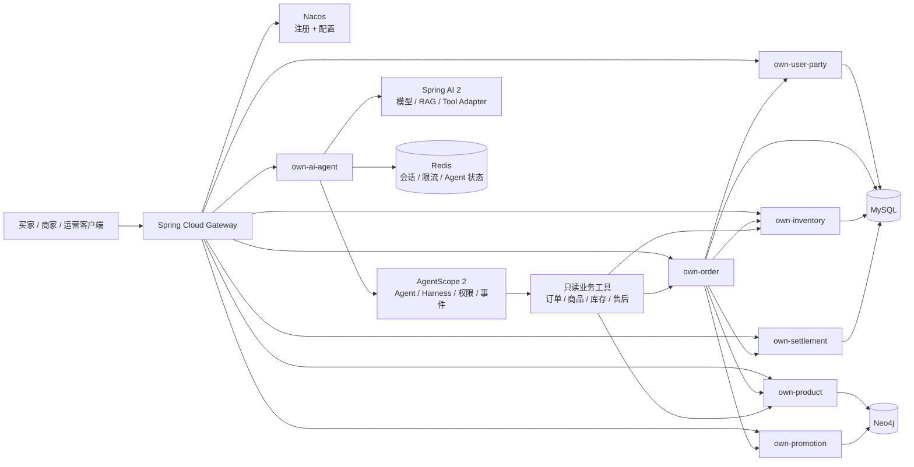

# 框架升级与现有业务迁移实施计划

> 状态：已复审；代码迁移已推进至 P4。Java 17 / Boot 4 主代码、JUnit 5 测试与 Neo4j DAO 查询迁移已通过本地 Maven 验证；真实运行环境验证仍未执行。
>
> 当前基线：`jdk8` 分支、Java 8、Spring Boot 1.5.9、Spring Cloud Edgware、Eureka、Config Server、Zuul、Neo4j 3.5。
>
> 目标基线：Java 17+、Spring Boot 4.0.x、Spring Cloud 2025.1.x、Spring Cloud Alibaba 2025.1.0.0、Spring AI 2.0.x、AgentScope Java 2.x、Maven 3.9.16。

## 1. 目标与边界

本专项的目标是升级基础框架，同时保留现有多商家商城交易闭环：商品、促销、库存、购物车、订单、支付模拟、售后、文件、消息、工作流和 JWT/RBAC。

本专项不改变业务规则，不新增前端，不把模拟支付改成真实支付，也不在框架升级过程中引入新的结算政策。真实微信/支付宝、商家资金结算、OAuth、第三方物流和生产运维仍需独立授权与验收。

升级不是简单替换版本号，至少包含：

- Java 8 → Java 17+，`javax.*` → `jakarta.*`。
- Eureka/Config Server → Nacos 注册与配置中心。
- Zuul → Spring Cloud Gateway；旧版 Feign → OpenFeign。
- Springfox → Springdoc OpenAPI；旧 Zipkin starter → Micrometer/OpenTelemetry。
- Spring Data Neo4j 旧 OGM API → 新 Driver/数据访问方式。
- 新增独立 `own-ai-agent`，由 Spring AI 和 AgentScope 提供 AI 能力，不侵入订单和库存服务。

## 2. 版本基线

| 组件 | 当前 | 目标 | 说明 |
| --- | --- | --- | --- |
| JDK | 8 | 17 或更高 | 目标框架和 AgentScope 2 的运行基线 |
| Maven | 3.9.16 | 3.9.16 | Maven 3 稳定基线；不使用 Maven 4 |
| Spring Boot | 1.5.9.RELEASE | 4.0.x | 同步迁移 Spring Framework、Security、Actuator 和测试体系 |
| Spring Cloud | Edgware | 2025.1.x | 使用对应 release train BOM |
| Spring Cloud Alibaba | 未使用 | 2025.1.0.0 | 对应 Spring Boot 4.0.x、Spring Cloud 2025.1.x |
| Spring AI | 未使用 | 2.0.1 | Spring AI 2.x 对应 Spring Boot 4.x |
| AgentScope Java | 未使用 | 2.0.3 | 独立 Agent 运行时与 Harness |
| Neo4j | 3.5 Community | 代码先迁移，服务端另行升级 | 新版 Driver 不应长期连接已停止维护的服务端 |
| MySQL | 5.7 | 迁移期兼容，生产另行升级 | 不改变交易表语义，但正式部署前需升级受支持版本 |

版本号以实施时 Maven Central 和官方 release notes 为准；任何版本变更都必须先在根 POM 的 BOM 入口中锁定，子模块不得重复声明。

参考资料：

- [Spring Cloud Alibaba 2025.1.x 官方说明](https://github.com/alibaba/spring-cloud-alibaba/tree/2025.1.x)
- [Spring AI 官方文档](https://docs.spring.io/spring-ai/reference/)
- [AgentScope Java 2 官方文档](https://java.agentscope.io/)
- [Maven Wrapper 官方文档](https://maven.apache.org/tools/wrapper/)

## 3. 分支与交付策略

当前 `jdk8` 分支包含 Maven 3.9.16 和旧框架可回退基线，迁移分支必须从它创建，不能从缺少这些提交的 `master` 创建。创建或切换分支属于独立的 Git 操作，仅在获得明确授权后执行：

```bash
git switch jdk8
git switch -c framework-upgrade-sca-2025.1
```

旧的 `jdk8` 分支在新主线稳定前保留。每个阶段必须包含代码、测试、Compose 或替代依赖验证、README 同步，以及旧路径移除检查。除专门标记的调查提交外，阶段完成点必须保持整个 Maven Reactor 可编译；不能把长期红构建留给下一阶段。

## 4. 目标架构



核心原则：AI Agent 只能通过经过 RBAC、幂等和审计的业务工具访问交易服务，不能直接访问数据库，也不能绕过订单、库存和结算状态机。

## 5. 分阶段实施

### P0：可回退基线与兼容性审计

目标：在不改变当前运行框架的前提下，形成可重复的升级输入和验收基线。

- 记录当前分支、Maven Wrapper、JDK 要求、模块清单、测试结果和 Compose 校验结果。
- 自动盘点 `javax.persistence`/Servlet/Validation/Mail、Neo4j OGM、Springfox、旧 MySQL 驱动、Eureka/Config/Zuul/Feign 和 Docker 插件等阻断项。
- 固化网关路径、配置键、数据库迁移、事件、JWT/RBAC、幂等和交易状态机契约。
- 先把根 POM 中会被所有模块无条件继承的依赖收敛到正确的模块或 `dependencyManagement`；此步骤仍使用旧版本并保持行为不变。
- 建立依赖收敛和漏洞检查入口，但不在本阶段引入新框架 BOM。

完成标准：旧框架全量构建仍可通过；兼容性清单可由脚本重复生成；不存在“先换 BOM、再等待业务代码修复”的红构建窗口。

当前进度：已增加 `scripts/framework-upgrade-inventory.sh` 和兼容性基线文档，并修复 Springfox 2.10 注解及旧 Jackson 异常签名导致的基线编译失败；根 POM 的无条件运行依赖已移除，服务和公共模块按实际用途显式声明 Eureka、Config、Actuator、测试、Lombok 与 Mail。JDK 8 全量 `clean verify` 已通过。

### P1—P3：平台切换组合（不可拆分合并）

目标：以一个完整、可编译的变更集完成 Java 17、Boot 4、Nacos 和 Gateway 切换。P1、P2、P3 是同一交付包内的工作分解，不得把其中任一中间状态合并或标记为可发布。

这样安排是必要的：目标 Spring Cloud Gateway 基于 Spring Framework 7、Boot 4 和 Reactor；而 Maven Central 中 `spring-cloud-starter-netflix-zuul` 的最新发布停在 2.2.10.RELEASE，不能作为 Boot 4 目标依赖。Spring Cloud Alibaba 2025.1.0.0 同时要求 Boot 4、Cloud 2025.1 和 JDK 17+，并要求 Nacos 配置使用 `spring.config.import`，不再支持 `bootstrap` 加载。

#### P1：Java 17、Boot 4 与公共 API

- 根 POM 切换 Spring Boot 4.0.x、Spring Cloud 2025.1.x 和 Spring Cloud Alibaba 2025.1.0.0，更新 Compiler、Surefire、Resources、Jar 和 Spring Boot 插件。
- 将需要迁移的 `javax.persistence`、Servlet、Validation、Mail 和 Annotation API 改为 `jakarta.*`；`javax.crypto` 等仍属于 JDK 的包不得机械替换。
- 统一 Jackson、错误响应、字段序列化、文件上传和测试基础设施；JUnit 4/旧 Mockito 已迁移到 JUnit 5。
- Springfox 改为 Springdoc；旧 MySQL 坐标和驱动类同步迁移。
- 移除 Neo4j OGM 注解、`GraphRepository` 和 `Neo4jOperations` 等编译阻断 API；数据库服务端和真实数据迁移在 P4 验证。
- JWT、RBAC、服务边界令牌、关联 ID、幂等请求头和外部 API 字段保持原业务契约。

#### P2：Nacos 替换 Eureka 与 Config Server

- 使用 Nacos Discovery 和 Nacos Config starter。
- 将 Config Server 的 `config-repo` 转换为 Nacos Data ID、Group 和 Namespace。
- Compose 增加 Nacos，并保留健康检查和本地初始化说明。
- 将 `bootstrap.yml` 迁移为 `spring.config.import` 配置。
- 移除 `own-config`、`own-eureka-server`、Eureka 与 Config Client 的启动路径；旧配置文件只作为迁移对照，不得继续被新服务加载。

#### P3：Zuul 替换 Spring Cloud Gateway

- Zuul 路由迁移为 Gateway `RouteDefinition`。
- Servlet Filter/Zuul Filter 改为 WebFlux Gateway Filter。
- 保留 JWT 校验、身份头重建、内部令牌注入和路径权限。
- 迁移所有 `/product/**`、`/user/**`、`/sale/**`、`/inventory/**`、`/order/**`、`/settlement/**` 路由。
- 以 Spring Cloud LoadBalancer 替换 Ribbon；以 Sentinel 或 Gateway 原生方案替换旧限流。
- 统一 CORS、错误响应、关联 ID 和请求体大小限制。

组合完成标准：整个 Maven Reactor 在 JDK 17 下 `clean verify` 通过；Nacos 注册与配置、Gateway 路由、JWT/RBAC、路由前缀和直连业务服务拒绝测试全部通过。不能只验证 `own-common` 或单个示例服务。

当前进度：目标 Nacos Data ID 配置集和 Nacos 3 Admin API 导入脚本已建立，配置包含 MySQL、Neo4j Bolt URI 与 Gateway 路由映射。根 POM 已切换到 Java 17、Spring Boot 4.0.0、Spring Cloud 2025.1.0 与 Spring Cloud Alibaba 2025.1.0.0；旧 `own-config`、`own-eureka-server`、Eureka、Config Server、Zuul 和 Spotify Docker Maven Plugin 已移除。业务服务使用 Nacos Discovery/Config，`bootstrap.yml` 已迁为 `application.yml` 的 `spring.config.import`；Compose 使用 Nacos 3.1.1，所有业务 Dockerfile 使用 Java 17。Jakarta、Springdoc、MySQL 新坐标、Neo4j 新 Repository 注解/API 与 Micrometer 首轮迁移已通过 JDK 17 全 Reactor `-DskipTests compile`。真实 Nacos、Neo4j、MySQL、Docker Compose 与 RocketMQ 的联调尚未运行；因此不能将本阶段表述为运行环境验收完成。

### P4：数据运行时与基础服务迁移

顺序：`own-user-party` → `own-product` → `own-promotion` → `own-file` → `own-send-server` → `own-workflow`。

- MySQL 驱动迁移为 `com.mysql:mysql-connector-j`，驱动类改为 `com.mysql.cj.jdbc.Driver`。
- 迁移 Spring Data JPA 查询与实体注解。
- 使用 P1 已完成的新 Repository/Driver API，设计 Neo4j 服务端升级、数据备份、恢复与抽样校验步骤。
- 重新验证商品、用户和促销图数据的读写、关系方向、索引约束与 Cypher 参数化。
- Springfox 替换为 Springdoc OpenAPI。
- KIE/Drools 依赖单独进行 Java 17 兼容性验证，不静默降级。

完成标准：基础服务独立启动，原有契约测试和真实升级副本上的数据读写测试通过；仅使用 Mock 或内存替代品不算数据迁移完成。

当前进度：已完成 Neo4j 查询静态审计与代码迁移，并形成 [数据访问现代化运行手册](neo4j-modernization-runbook.md)。用户、商品、促销 DAO 的 `START/node()` 与 OGM `{0}` 查询已迁为 `MATCH` 与 `$0` 绑定；动态关系类型入口已替换为固定关系方法，旧入口明确拒绝调用。三个服务的相关 Maven 测试已通过。仍须按手册在隔离副本执行备份恢复、图计数比对和业务读写验证；在此之前 P4 不能标记为运行时完成。

一致性 P0 进度：订单服务已增加可选 RocketMQ Outbox 发布适配器和 `trade_message_inbox` 前向迁移。消息只会从已持久化的 `ord_event` 发布，发布失败继续由 Outbox 重试；RocketMQ 未配置时保持禁用。异步下单已使用 `trade_order_saga` 的持久化工作器按库存预占、优惠券预占、补偿和重试推进，并在成功后才清理选中的购物车。库存、促销、结算的业务消费者、结果事件、死信和对账仍须逐服务接入，不能将当前发布端或工作器表述为端到端消息事务完成。

### P5：库存、订单与结算迁移

顺序：`own-inventory` → `own-settlement` → `own-order`。

必须保持：库存不变量、预占/确认/释放幂等、订单和售后状态机、支付与退款事务边界、Outbox、地址快照、商家归属、JWT actor 和 `Idempotency-Key` 契约。

完成标准：多商家拆单、价格变化拒绝、库存并发、支付回调幂等、整单退款、部分退款和售后库存回补测试全部通过。

### P6：Spring AI 与 AgentScope 独立接入

新增 `own-ai-agent`，不把 AI 依赖直接塞入订单、库存和结算服务。

| 组件 | 职责 |
| --- | --- |
| Spring AI 2.x | ChatClient、模型适配、Embedding、RAG、结构化输出、Tool Adapter |
| AgentScope 2.x | Agent 执行循环、事件流、权限、人机确认、Workspace、Subagent、会话恢复 |
| own-ai-agent | REST/SSE、JWT/RBAC、工具注册、审计、会话和模型配置 |
| 业务服务 | 继续拥有订单、库存、商品、支付和售后事实 |

第一批只实现只读工具：订单状态、商家子订单、商品库存、售后状态和运营摘要。退款、发货、改价、库存调整、授予角色等写操作必须经过人工确认、幂等键、权限校验和审计。

完成标准：模型不可用时返回明确错误；工具越权被拒绝；事件流可追踪；同一 Agent 请求不会重复写业务状态；敏感信息不会进入普通日志。

### P7：可观测性、容器与生产验证

- JDK 17 运行时镜像，Compose 增加 Nacos、Redis 和新观测组件。
- Micrometer Observation/Tracing、OpenTelemetry、Prometheus 和日志脱敏。
- Agent 调用、工具调用、人工批准和拒绝事件审计。
- 数据库迁移、备份恢复、滚动发布和回滚演练。
- Gateway、Nacos、数据库和 AI Provider 的密钥改为 Secrets 管理。

完成标准：Compose 启动、Smoke Test、业务回归、故障注入、备份恢复和安全检查均有记录。

## 6. 业务迁移验收矩阵

| 场景 | 必须证明的内容 |
| --- | --- |
| 登录与刷新 | JWT 签发、刷新轮换、撤销和过期行为保持一致 |
| 商品浏览 | 公开浏览、商家归属、上下架和价格快照保持一致 |
| 多商家下单 | 一张母订单、多张子订单、地址快照、运费和优惠计算一致 |
| 库存竞争 | 并发预占不超卖，超时释放不重复，退款只回补一次 |
| 支付与退款 | 模拟回调幂等，订单状态和库存状态匹配 |
| 售后 | 申请、审核、退货、退款、换货状态迁移不越权 |
| Outbox | 事件与状态同事务，未投递事件可查询和重试 |
| Agent 只读工具 | 只能读取当前 actor 有权访问的数据 |
| Agent 写工具 | 默认关闭；开启时必须人工确认、幂等和审计 |
| 配置中心 | Nacos 配置缺失、变更和回滚行为明确 |

## 7. 回滚和并行运行

- 框架迁移期间保留 `master`/`jdk8` 作为旧系统基线。
- 不修改既有数据库迁移文件；新增迁移必须向前兼容。
- 旧服务和新服务不能同时写同一业务事实，避免双写产生两个事实来源。
- 数据库先执行向前兼容迁移，再切换服务流量；回滚优先回滚应用，不回滚已执行的破坏性数据库迁移。
- Gateway 路由切换按服务逐步切流；订单、库存和结算最后切换。

## 8. 每阶段固定验证命令

```bash
# 使用 Maven 3.9.16 和 JDK 17
java -version
./mvnw -version
./mvnw -B -ntp clean verify

# 依赖和格式检查
./mvnw -B -ntp dependency:tree
git diff --check

# 数据库和 Compose
bash scripts/validate-migrations.sh
docker compose --env-file .env config --quiet

# Docker 可用环境再运行
docker compose --env-file .env up --build -d
bash scripts/smoke-test.sh
```

未能运行的检查必须记录具体原因；JDK、数据库、Nacos、模型凭据或 Docker 缺失时，不得把本地静态验证描述为端到端通过。

## 9. 完成定义

只有同时满足以下条件，才认为框架升级完成：

1. 全部服务在 Java 17 和 Maven 3.9.16 下构建通过。
2. Eureka、Config Server、Zuul 和旧版 Feign 路径已移除，没有残留直接消费者。
3. Nacos、Gateway、OpenFeign、Jakarta API 和新版数据访问配置已在 Compose 与测试环境验证。
4. 现有交易状态机、库存、支付模拟、售后和 Outbox 契约回归通过。
5. `own-ai-agent` 的只读工具通过权限、事件、审计和敏感信息测试。
6. 所有新增配置、部署命令、已实现能力和未实现边界同步到 README。
7. 真实支付、真实结算、OAuth、第三方物流和生产运维仍单独标注为外部验收项。
