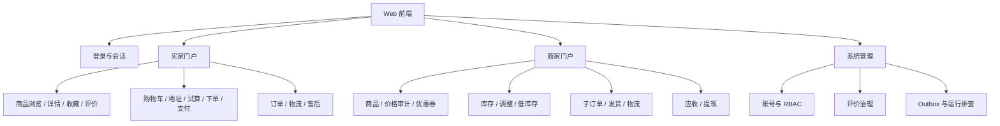

# micro-server-own 前端项目交接说明

> 本文可直接作为前端 AI 的上下文或首条需求。它描述的是当前后端已经暴露的能力；不应据此虚构支付、物流、消息或运营后台的未实现接口。

## 1. 项目目标

为 `micro-server-own` 构建一个响应式 Web 前端，服务于三类用户：买家、商家和平台系统管理员。它是一个多商家商城的业务操作界面，而不是只展示商品的静态站点。

完整主链路是：买家浏览商品 → 收藏或加入购物车 → 选择地址与优惠券试算 → 创建按商家拆分的订单 → 创建模拟支付单 → 商家发货 → 买家查看物流并签收 → 评价；订单还支持取消、退款、退货退款与同 SKU 换货的已有服务端流程。

前端项目应独立于后端仓库创建，例如命名为 `micro-server-own-web`。推荐 TypeScript、Vue 3、Vite、Vue Router、Pinia 和 Element Plus；如果团队已选 React，可等价采用 React + TypeScript，但不得改变本说明中的接口与业务边界。

## 2. 后端事实与接入边界

| 项目 | 当前事实 |
| --- | --- |
| 网关地址 | 开发默认 `http://localhost:9632`；前端只访问网关。 |
| 技术基线 | Java 17、Spring Boot 4、Spring Cloud Alibaba 2025.1.0.0、Nacos 3。 |
| API 前缀 | 网关按 `/user`、`/product`、`/sale`、`/inventory`、`/order`、`/settlement`、`/file` 转发。 |
| 响应外层 | 常规成功响应为 `{ "data": ..., "status": 200, "message": "success" }`。HTTP 错误仍应优先依据 HTTP 状态处理。 |
| 身份认证 | 登录后以 `Authorization: Bearer <accessToken>` 调用受保护接口。网关会重建可信身份头。 |
| 写请求 | 除登录、刷新令牌等少数认证端点外，业务写操作必须携带唯一 `Idempotency-Key`。 |
| 关联追踪 | 可选传递 `X-Correlation-Id`；服务会透传或生成该值。 |
| 时间与金额 | 时间过滤参数为 Unix 毫秒；金额使用十进制字符串显示和计算，前端不得使用 JS 浮点数累加后作为最终金额。 |

前端不得发送或相信 `X-Actor-Id`、`X-Actor-Type`、`X-User-Id`、`X-Role-Names`、`X-Permission-Names` 与内部服务令牌。这些由网关从 JWT 建立，直接调用 `/internal/**` 也不是前端能力范围。

## 3. 身份、登录与菜单

### 3.1 登录与会话

| 用途 | 方法与网关路径 | 说明 |
| --- | --- | --- |
| 获取令牌 | `POST /user/login/token` | 请求含账号、密码和所选身份类型；保存 access token 与 refresh token。 |
| 刷新令牌 | `POST /user/login/refresh` | access token 过期时只发起一次刷新，成功后重放原请求；刷新失败则退出。 |
| 退出 | `POST /user/login/logout` | 传入 refresh token，再清空本地会话。 |
| 我的授权 | `GET /user/api/v1/account/authorization` | 用于初始化角色、权限和动态菜单。 |
| 我的资料 | `GET/PUT /user/api/v1/account/profile` | 个人中心。 |
| 会话管理 | `GET/DELETE /user/api/v1/account/sessions` | 展示与撤销登录会话。 |
| 买家注册 | `POST /user/api/v1/auth/registrations` | 公共接口。 |

令牌存储优先采用内存 access token + 安全的刷新策略；如果当前后端没有 HttpOnly Cookie 交付能力，可在开发阶段用受控的 `sessionStorage` 保存令牌，并在前端项目 README 中标明该取舍。请求拦截器遇到 `401` 时刷新一次；收到 `403` 时保留当前页面并展示“无此权限”，而不是反复刷新。

### 3.2 三类门户与菜单

| 身份 | 入口与主要页面 |
| --- | --- |
| `ROLE_BUYER` | 商城首页、商品列表/详情、收藏、购物车、结算、我的订单、售后、地址簿、个人资料与会话。 |
| `ROLE_MERCHANT` | 商家工作台、商品管理、价格审计、优惠券模板、库存与调整记录、低库存提醒、运费规则、子订单履约、评价回复、结算与提现。 |
| `ROLE_SYSTEM` | 账号角色授权、角色权限、评价举报/敏感词处置、订单 Outbox 排查、运营维护页面。 |

以 `GET /user/api/v1/account/authorization` 返回的权限作为路由守卫与按钮可见性的事实来源；隐藏按钮只改善体验，不能替代后端 RBAC。

## 4. 信息架构



建议路由：

```text
/login, /register
/shop, /shop/products/:id, /shop/favorites
/buyer/cart, /buyer/checkout, /buyer/orders, /buyer/orders/:orderNo
/buyer/after-sales, /buyer/addresses, /account/profile, /account/sessions
/merchant/dashboard, /merchant/products, /merchant/products/:id/edit
/merchant/inventory, /merchant/orders, /merchant/orders/:subOrderNo
/merchant/coupons, /merchant/freight, /merchant/reviews, /merchant/settlement
/system/accounts, /system/roles, /system/reviews, /system/outbox
```

首版不需要营销落地页、CMS、直播、IM、真实支付收银台或独立物流地图。

## 5. 页面与核心接口

以下是前端首版应实现的页面优先级和可用接口。路径均已包含网关前缀。

### P0：登录、买家购买闭环

| 页面 | 主要接口 | 交互要求 |
| --- | --- | --- |
| 商品列表 | `GET /product/api/v1/products?keyword=&categoryId=&merchantId=&page=&size=`；`GET /product/api/v1/categories` | 支持关键词、分类、商家和分页；只显示可售商品。 |
| 商品详情 | `GET /product/api/v1/products/{id}`；`GET/POST /product/api/v1/products/{id}/reviews` | 展示 SKU 属性、价格、商家、评价；加购前校验登录。 |
| 收藏 | `GET /product/api/v1/favorites`、`POST/DELETE /product/api/v1/favorites/{productId}` | 写操作产生新的幂等键。 |
| 购物车 | `GET/POST /order/api/v1/cart/items`、`PUT/DELETE /order/api/v1/cart/items/{id}` | 商品按商家分组，数量变更需节流并保留服务端返回结果。 |
| 地址簿 | `GET/POST /user/api/v1/addresses`、`GET/PUT/DELETE /user/api/v1/addresses/{id}`、`POST /user/api/v1/addresses/{id}/default` | 结算必须选择地址；填写姓名、11 位手机号、省、市、区、详细地址。 |
| 结算试算 | `POST /order/api/v1/checkouts/quote` | 使用所选购物车项、`addressId` 和券选择；必须展示每个商家子单的商品金额、优惠、运费、应付金额。 |
| 创建订单 | `POST /order/api/v1/orders` | 复用同一个结算快照；处理 `409 PRODUCT_CHANGED`，提示价格/商品状态已变、保留购物车并要求重新试算。 |
| 订单 | `GET /order/api/v1/orders/page`、`GET /order/api/v1/orders/{orderNo}/detail`、`POST /order/api/v1/orders/{orderNo}/cancel` | 筛选状态、分页、展示母订单与商家子单。 |
| 支付 | `POST /settlement/api/v1/payments`、`GET /settlement/api/v1/payments/{paymentNo}` | 当前是模拟支付。前端应做“支付结果查询/轮询”页面，不自行调用仅系统可用的 simulate-success 接口。 |
| 物流与签收 | `GET /order/api/v1/sub-orders/{subOrderNo}/logistics-traces`、`POST /order/api/v1/sub-orders/{subOrderNo}/receive` | 按子订单展示轨迹；签收须二次确认。 |

结算请求模型以实际 DTO 为准，前端至少发送：

```json
{
  "cartItemIds": [101, 102],
  "addressId": 88,
  "coupons": [
    { "couponNo": "COUPON-PLATFORM-001" },
    { "couponNo": "COUPON-MERCHANT-001", "merchantId": 9 }
  ]
}
```

不要向新的前端流程传递自由文本 `shippingAddress`；收货信息必须由 `addressId` 在服务端取快照。店铺券的 `applicableAmount` 可省略，订单服务会用对应商家的商品金额补齐；前端不可提交最终优惠或应付金额。

### P1：买家售后、评价与账户

| 页面 | 主要接口 | 交互要求 |
| --- | --- | --- |
| 售后 | `GET/POST /order/api/v1/after-sales`、`GET /order/api/v1/after-sales/page`、`GET /order/api/v1/after-sales/{afterSaleNo}` | 订单明细中按可售后商品发起申请；状态机驱动操作按钮。 |
| 退货/换货流程 | `POST /order/api/v1/after-sales/{no}/return-shipment`、`.../close`、`.../exchange-receive` | 只显示当前状态允许的下一动作；所有提交附幂等键。 |
| 评价与举报 | `POST /product/api/v1/products/{id}/reviews`、`POST .../reviews/{reviewId}/reports` | 后端校验是否已签收；前端不自行判断可评价资格。 |

### P2：商家运营后台

| 页面 | 主要接口 | 交互要求 |
| --- | --- | --- |
| 商品管理 | `GET/POST /product/api/v1/merchant/products`、`PUT /product/api/v1/merchant/products/{id}`、`POST .../{id}/sale-status` | 编辑自有商品，禁止更改所属商家；上下架要有确认提示。 |
| 价格审计 | `GET /product/api/v1/merchant/products/{id}/price-audits` | 商品改价后查看前后金额和原因。 |
| 优惠券 | `GET /sale/api/v1/coupons/merchant/summary`、`GET/POST /sale/api/v1/coupons/merchant/templates`、`POST .../templates/{id}/status` | 商家管理店铺券模板，不设计跨商家券操作。 |
| 库存 | `GET /inventory/api/v1/stocks/{productId}`、`POST /inventory/api/v1/stocks/{productId}/adjustments` | 调整必须填写原因；明确展示可用、预占、已售，冲突时刷新数据。 |
| 低库存 | `GET /inventory/api/v1/merchant/low-stock-alerts`、`PUT /inventory/api/v1/stocks/{productId}/low-stock-alert-rule` | 可配置阈值，展示未处理低库存。 |
| 运费 | `GET/PUT /order/api/v1/merchant/freight-rule` | 固定运费与可选免邮门槛。 |
| 履约工作台 | `GET /order/api/v1/merchant/sub-orders`、`GET /order/api/v1/merchant/sub-orders/{no}`、`POST .../{no}/ship`、`.../shipment-correction`、`.../logistics-traces` | 只操作自己子单，发货表单包括承运商和运单号。 |
| 评价回复 | `POST /product/api/v1/merchant/reviews/{reviewId}/reply` | 回复后刷新评价详情。 |
| 结算 | `GET /settlement/api/v1/merchant/settlement/balance`、`POST /settlement/api/v1/merchant/settlement/withdrawals` | 明确显示“模拟结算/提现”标记。 |

### P3：系统管理

系统页面只在具有 `ROLE_SYSTEM` 与对应权限时展示。可实现角色权限维护、指定账号商家角色授予、评价举报/敏感词治理，以及只读的订单 Outbox 排查。支付回调、库存引导、内部对账和 `/internal/**` 均不应暴露为普通管理 UI。

## 6. 前端工程约束

1. 建立统一 HTTP 客户端：自动加 Bearer token、`X-Correlation-Id`，且对写请求自动生成 UUID `Idempotency-Key`。
2. 同一次用户提交因网络重试而重发时，必须复用原 `Idempotency-Key`；按钮禁用与请求状态管理不能替代幂等键。
3. 统一处理：`400` 参数错误、`401` 登录失效、`403` 无权限、`404` 不存在、`409` 业务冲突、`422` 业务校验失败、`5xx` 可重试服务异常。
4. 对 `409 PRODUCT_CHANGED` 弹出明确对话框，跳回试算；对库存不足、券不可用等错误显示服务端消息并保留可编辑状态。
5. 路由采用懒加载，桌面优先兼容移动端；买家端应在 375px 宽度可用，商家/系统工作台可优先桌面布局。
6. 金额显示统一使用货币格式化函数；状态枚举、接口路径、权限码集中定义，禁止散落字符串。
7. 不在前端保存或展示 `INTERNAL_SERVICE_TOKEN`、Nacos、数据库、支付渠道或对象存储密钥。
8. 为登录刷新、路由权限、结算试算、重复下单、`409 PRODUCT_CHANGED`、退款/售后状态按钮编写单元或端到端测试。

## 7. 建议交付顺序

1. 建立项目骨架、主题、布局、HTTP 客户端、会话与权限路由。
2. 完成商品浏览、登录/注册、地址簿、购物车与结算试算。
3. 完成订单、模拟支付结果、物流、签收与买家售后。
4. 完成商家商品、库存、运费、履约、券和结算工作台。
5. 完成系统运营页面与错误/空态/加载态、测试、部署文档。

每阶段应交付可运行页面、接口类型定义、Mock 或联调说明及验收清单；不要等所有页面完成才开始后端联调。

## 8. 当前明确不做

- 不做真实微信/支付宝收银、真实渠道回调验签或真实商户清分。
- 不做第三方物流下单、地图轨迹、客服 IM、直播、CMS、推荐算法、拼团秒杀或独立移动 App。
- 不把 RocketMQ Outbox 或 Inbox 表现为前端可感知的“实时消息事务”；它们不是已完成的端到端消息 Saga。
- 不绕过网关直连微服务，不调用内部接口，不在前端模拟 `SYSTEM`、`MERCHANT` 或 `BUYER` 身份。

## 9. 可直接交给前端 AI 的任务文本

```text
请基于 docs/frontend/frontend-project-brief.md 为 micro-server-own 创建独立的 TypeScript 前端项目。

优先采用 Vue 3 + Vite + Vue Router + Pinia + Element Plus。前端仅通过 http://localhost:9632 网关访问 API，使用 Bearer JWT 与 Refresh Token；所有业务写请求自动生成并正确复用 Idempotency-Key。先交付登录、按角色路由、商品浏览、地址簿、购物车、结算试算、创建订单、订单详情和模拟支付结果页，再逐步实现商家与系统工作台。

请先输出目录设计、状态模型、路由/权限表和接口封装方案，然后实现 P0。不要自行发明后端接口、不要调用 /internal/**、不要伪造身份头或真实支付流程。对 401、403、409 PRODUCT_CHANGED、422 和网络重试给出明确体验；为关键流程编写测试和 README 启动说明。
```

## 10. 联调前检查清单

- 后端从根 README 的 Nacos/Compose 或本地启动流程运行，网关健康检查为 `GET /actuator/health`。
- 前端开发服务器配置 `/api` 或直接 API base URL 指向 `http://localhost:9632`，并正确处理跨域；优先使用 Vite 本地代理。
- 测试账号需分别具有买家、商家与系统角色；不要将真实账号、JWT、渠道密钥提交到仓库。
- 以实际返回的 OpenAPI、DTO 和响应报文为最终字段依据；本说明定义范围和行为，不取代接口契约。
